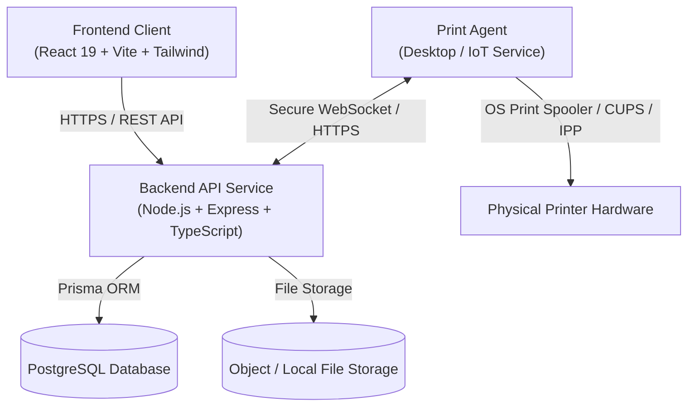
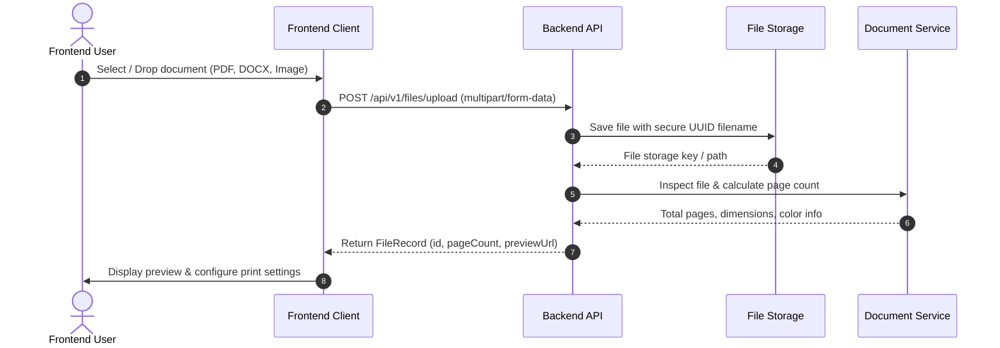
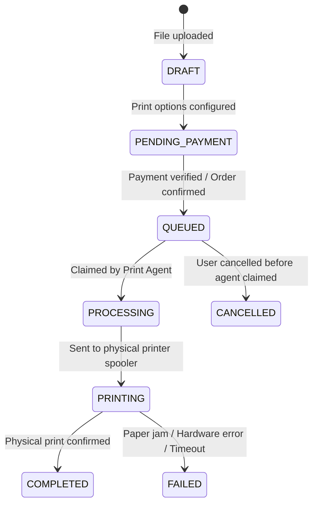
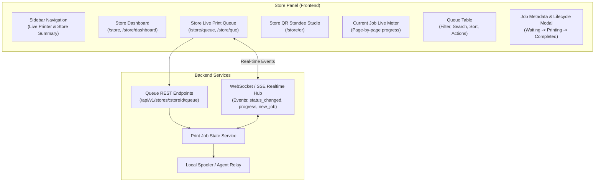
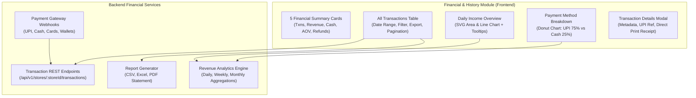
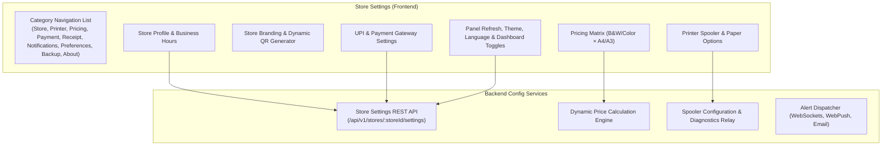
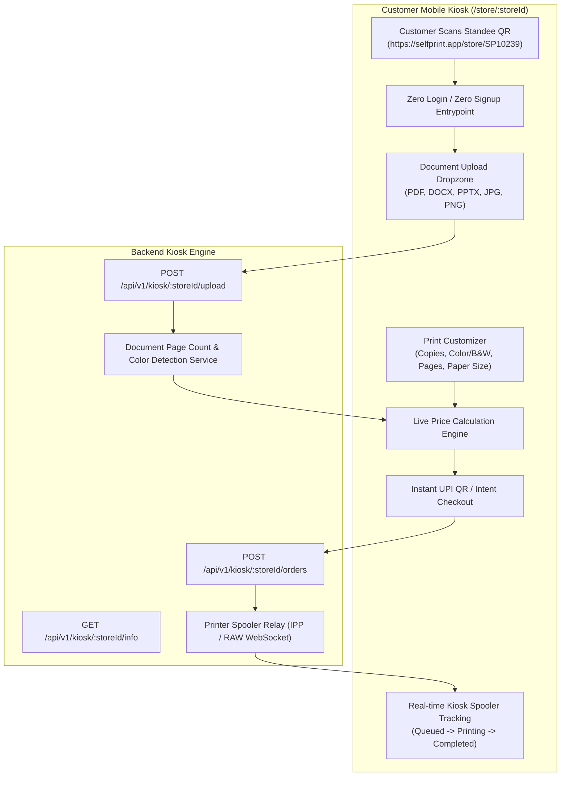
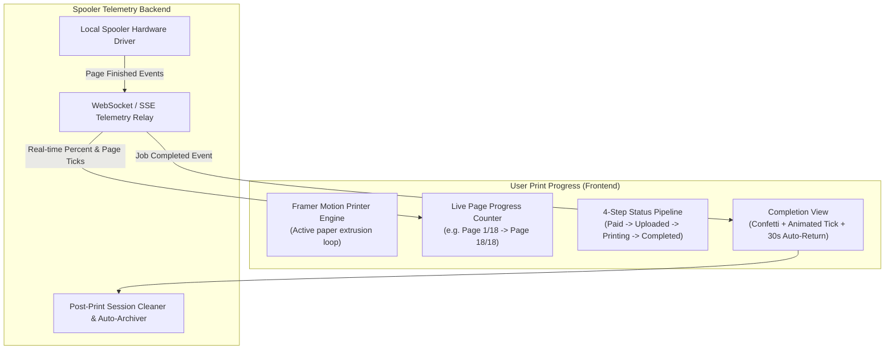

# ARCHITECTURE.md

Permanent single source of truth for the system architecture of the **Self-Print** platform.

---

## AI Development Instructions

Before making any code changes or proposing new features, every AI agent must:

1. **Read `MEMORY.md`** - Understand project state, completed work, and context.
2. **Read `ARCHITECTURE.md`** - Adhere strictly to the established system design and patterns.
3. **Read `RULES.md`** - Follow all coding standards, constraints, and practices.
4. **Read `API_CONTRACT.md`** - Ensure API endpoints, types, payloads, and responses match the contract.

> If any conflict exists between the requested changes and these files, **stop and resolve the conflict by updating documentation first**. Never invent new architectural patterns without updating this document.

---

## 1. Project Vision

**Self-Print** is a cloud-connected self-service printing platform that eliminates lines and manual USB transfers at print shops, libraries, and automated kiosks. Users upload files from any device (phone, laptop, tablet), customize their print configuration (color/BW, page ranges, copies, orientation, paper size), calculate costs, and send the job to a target printer station. An on-premise or cloud-connected Print Agent pulls the processed file and executes the print job securely.

---

## 2. High-Level Architecture



---

## 3. Frontend Architecture

- **Framework:** React 19 single-page application bundled with Vite.
- **Routing:** React Router v7 with nested layout hierarchy (`MainLayout` -> Page components).
- **Server State & Caching:** TanStack Query v5 managing server cache, invalidations, background refetches, and optimistic updates.
- **Client State:** React Context for global lightweight UI state (theme, active session, active print draft); local React `useState`/`useReducer` for component-isolated states.
- **HTTP Layer:** Reusable Axios singleton (`src/lib/axios.ts`) with request/response interceptors, automatic bearer token injection, and structured error extraction.
- **Form Management:** React Hook Form + Zod resolvers for type-safe client-side validation.
- **Component Architecture:**
  - `components/ui/`: Dumb atomic UI primitives (Buttons, Inputs, Modals, Badges).
  - `components/common/`: Shared compound components (Header, Footer, FileDropzone, StatusPill).
  - `components/layout/`: Page structural layouts (`MainLayout`).
  - `pages/`: Route-level container components orchestrating data fetching and UI composition.

---

## 4. Backend Architecture

- **Pattern:** Layered Architecture (Controller-Service-Repository/Model pattern).
- **Layer Responsibilities:**
  1. **Router Layer (`src/routes/`):** Defines endpoint paths, HTTP verbs, and attaches route-specific middlewares.
  2. **Middleware Layer (`src/middleware/`):** Handles authentication, request validation, rate limiting, and global error handling.
  3. **Controller Layer (`src/controllers/`):** Thin controllers responsible for extracting request data (`req.params`, `req.query`, `req.body`), invoking services, and formatting HTTP responses using `ApiResponse`.
  4. **Service Layer (`src/services/`):** Pure business logic, document manipulation, pricing calculations, job state transitions, and coordination. No direct `req`/`res` objects.
  5. **Data Access Layer (`src/lib/prisma.ts` / Prisma Client):** Type-safe database queries, transactional integrity, and database relations.

---

## 5. Print Agent Architecture (Future)

The Print Agent is an automated background daemon installed on the physical station machine:

- **Connectivity:** Persistent WebSocket connection (with exponential backoff reconnection) or periodic short polling to the backend.
- **Job Claiming:** Uses atomic database transactions to claim print jobs (`QUEUED` -> `PROCESSING`).
- **File Retrieval:** Downloads the pre-processed PDF from the storage layer via secure pre-signed URLs or temporary download tokens.
- **Driver Dispatch:** Interacts with local OS print spoolers (Windows GDI/Print Spooler API, Linux CUPS via IPP, or macOS spooler) using native CLI utilities or ghostscript/PDF tools.
- **Telemetry & Feedback:** Reports page-by-page progress, ink/paper status, and terminal states (`COMPLETED`, `FAILED`, `CANCELLED`) back to the backend.

---

## 6. Database Structure

PostgreSQL managed via Prisma ORM.

### Planned Core Models:
- **`User`:** Identity, email, optional password/auth metadata, role (CUSTOMER, ADMIN, STATION_OPERATOR).
- **`PrintJob`:** Tracks each printing request: user reference, printer station reference, file reference, options (copies, colorMode, pageRange, duplex, paperSize), status enum, cost, payment status.
- **`PrinterStation`:** Hardware location metadata, station code/QR code, online status, supported paper types, pricing rules.
- **`FileRecord`:** Original file name, MIME type, storage path/URL, file size, total page count, hash.
- **`PaymentTransaction` (future):** Payment gateway transaction ID, amount, status, timestamps.

---

## 7. Folder Structure

```
self-print/
├── frontend/
│   ├── public/             # Static public assets
│   ├── src/
│   │   ├── assets/         # Imported assets (images, SVGs)
│   │   ├── components/
│   │   │   ├── common/     # Cross-feature shared components
│   │   │   ├── layout/     # Structural shell layouts
│   │   │   └── ui/         # Design system primitives
│   │   ├── constants/      # Global client constants & route names
│   │   ├── context/        # React context providers
│   │   ├── hooks/          # Custom reusable React hooks
│   │   ├── lib/            # Third-party configurations (Axios, QueryClient)
│   │   ├── pages/          # Route view components
│   │   ├── routes/         # Router declarations
│   │   ├── services/       # Feature API call definitions
│   │   ├── styles/         # Global style declarations
│   │   ├── types/          # TypeScript interfaces and contracts
│   │   ├── utils/          # Pure helper functions
│   │   ├── App.tsx         # App wrapper with providers
│   │   ├── main.tsx        # React DOM mount point
│   │   └── index.css       # Tailwind base styles
│   ├── index.html
│   ├── package.json
│   ├── tsconfig.json
│   └── vite.config.ts
│
├── backend/
│   ├── prisma/
│   │   └── schema.prisma   # Prisma database schema definition
│   ├── src/
│   │   ├── config/         # Environment variables & constants
│   │   ├── constants/      # Status codes, enum constants
│   │   ├── controllers/    # Request/Response HTTP controllers
│   │   ├── database/       # DB connection & seeders
│   │   ├── lib/            # Singletons (Prisma client instance)
│   │   ├── middleware/     # Global & route middlewares
│   │   ├── models/         # TypeScript data interfaces & DTOs
│   │   ├── routes/         # Express router endpoints
│   │   ├── services/       # Business logic operations
│   │   ├── types/          # Backend TypeScript type declarations
│   │   ├── utils/          # Response formatters, logger
│   │   ├── app.ts          # Express app configuration
│   │   └── server.ts       # Server listener & graceful shutdown
│   ├── package.json
│   └── tsconfig.json
│
├── MEMORY.md
├── ARCHITECTURE.md
├── RULES.md
├── API_CONTRACT.md
├── package.json
└── README.md
```

---

## 8. State Management

- **Server Cache:** TanStack Query handles all remote entity fetching, caching, deduplication, and invalidation.
- **Transient UI State:** Local React component state (`useState`, `useReducer`) for forms, modal toggles, accordion states.
- **Global Context:** Minimal React Context only for cross-cutting client-only state (e.g., active theme, pending print file draft).
- **Rule:** Never duplicate server state in local/global state stores. Always use TanStack Query query keys and query client cache.

---

## 9. Authentication Strategy (Future)

- **Mechanisms:**
  - Customers: Passwordless magic link / OTP or Guest Checkout with temporary session tokens (QR code scoped).
  - Admins & Operators: JWT-based authentication with secure HTTP-only cookies or Bearer Authorization headers.
  - Print Agents: Machine API keys / mTLS client certificates for secure station identification.
- **Middleware:** Backend `authMiddleware` verifies tokens, attaches user payload to `req.user`, and rejects unauthorized requests with standardized 401/403 responses.

---

## 10. File Upload Flow



---

## 11. Print Job Lifecycle



---

## 12. Payment Flow (Future)

1. Frontend initiates checkout with `jobId`.
2. Backend creates payment order with gateway (Stripe / Razorpay / UPI).
3. Frontend presents payment modal/redirect.
4. Payment gateway sends webhook to Backend (`POST /api/v1/payments/webhook`).
5. Backend verifies webhook signature, marks job status as `QUEUED`, and notifies user.

---

## 13. Deployment Strategy

- **Frontend:** Static build (`dist/`) deployed to CDN / Edge Hosting (Vercel, Netlify, Cloudflare Pages, or AWS S3+CloudFront).
- **Backend:** Containerized Node.js service (Docker) deployed on cloud container platforms (AWS ECS, Render, Railway, DigitalOcean App Platform, or VPS with PM2).
- **Database:** Managed PostgreSQL (AWS RDS, Supabase, Neon, or Railway).
- **File Storage:** S3-compatible cloud storage (AWS S3, Cloudflare R2, Supabase Storage).

---

## 14. Technology Stack Summary

| Domain | Technology | Purpose |
|--------|------------|---------|
| Frontend Core | React 19, TypeScript 5.7 | UI component tree and typing |
| Frontend Bundler | Vite 6 | Rapid compilation and HMR |
| Styling | Tailwind CSS 3.4, PostCSS | Utility-first styling |
| Icons | Lucide React | Modern vector iconography |
| Client Routing | React Router v7 | Single-page application routing |
| Client State & Query | TanStack Query v5 | Server state caching and sync |
| HTTP Client | Axios 1.7 | HTTP communication with interceptors |
| Forms & Validation | React Hook Form, Zod | Schema validation and form inputs |
| Backend Core | Node.js, Express 4.21, TypeScript | Web server runtime and REST API |
| Database & ORM | PostgreSQL, Prisma ORM 6.3 | Relational database and type-safe data access |
| Security | Helmet, CORS, dotenv | Security headers and environment config |
| Logging | Morgan | HTTP request logging |

---

## 15. Scalability Strategy

- **Stateless Backend:** Backend instances maintain no in-memory session state; horizontal scaling behind a load balancer is seamless.
- **Asynchronous Job Processing:** Heavy document rendering and conversion (e.g. LibreOffice DOCX->PDF) handled asynchronously via background queues (BullMQ / Redis) when volume grows.
- **Direct-to-S3 Uploads (Future):** Pre-signed URLs for direct client-to-storage uploads to offload file payload bandwidth from API servers.

---

## 16. Security Principles

1. **Input Validation:** Every incoming request validated with Zod / Express-Validator at the boundary.
2. **Sanitized Storage:** File uploads assigned randomized UUID names; file types strictly validated against whitelist.
3. **Principle of Least Privilege:** Database users and API tokens scoped strictly to necessary tables and operations.
4. **Security Headers:** Strict Helmet security headers enabled (CSP, HSTS, X-Content-Type-Options).
5. **No Secrets in Code:** All credentials stored in environment variables, never committed to Git.

---

## 17. Performance Principles

1. **Zero Runtime CSS:** Tailwind CSS purges unused classes, producing tiny CSS bundles.
2. **Aggressive Query Caching:** TanStack Query prevents duplicate network requests and reuses fresh cache entries.
3. **Database Indexing:** Prisma schema indexed on foreign keys, job statuses, and search parameters.
4. **Stream Processing:** Large files streamed directly rather than buffered completely in memory.

---

## 18. Store Panel & Queue Management Module



### 18.1 Print Job Lifecycle & Queue Status Flow
Print jobs progress through strict deterministic states:
1. **Waiting (`Waiting` - Amber badge):** Job uploaded and queued in store's FIFO/priority backlog with allocated queue index (e.g. `In queue #1`).
2. **Printing (`Printing` - Indigo badge):** Job actively claimed by printer spooler; tracks live page increment (e.g. `1 / 12 pages` -> `8%`).
3. **Completed (`Completed` - Emerald badge):** All pages successfully printed and verified.
4. **Failed (`Failed` - Rose badge):** Hardware interruption (e.g. `Paper jam`, `Out of toner`, `Spooler error`); supports `Print Again / Retry`.
5. **Cancelled (`Cancelled` - Slate badge):** User or operator cancelled the job before/during processing; triggers automatic refund workflow.

### 18.2 Real-time Queue Architecture
- **Polling Fallback:** 5-second interval ticker for guaranteed synchronization.
- **WebSocket / Server-Sent Events (SSE):** Event payload stream for instant UI updates:
  - `print_job:new_job`: Adds incoming customer print request to queue head.
  - `print_job:progress`: Increments current printing page and progress bar percentage without full page reload.
  - `print_job:status_changed`: Smoothly updates status badges and counters.
  - `printer:status_update`: Updates online/offline and paper/toner telemetry.

---

## 19. Financial Transactions & Revenue Analytics Module



### 19.1 Privacy-First Financial Architecture
- **Zero Document Storage:** Under no circumstances are uploaded customer documents or PDF files stored or linked with financial transaction history records.
- **Pure Transaction Metadata:** Stores only transaction ID, job reference ID, customer name, phone number, page count, copy count, paper size, color mode, total amount, payment provider/method, UPI reference number, timestamp, and operator identity.
- **Audit & Export Pipeline:** Enables instant client-side or backend-generated CSV/Excel downloads and direct receipt printing without latency.

## 20. Store Settings & Configuration Module



### 20.1 Store Profile & Business Hours Management
- Configures permanent store identity: store name, branch name, owner details, support phone, GST number, physical address, geolocation coordinates, and daily opening/closing schedules with automatic kiosk off-hours protection.

### 20.2 Printer Configuration & Telemetry
- Manages active printer hardware selection, default paper sizes (`A4`, `A3`, `Letter`, `Legal`), default color modes, auto-start printing upon payment verification, duplex preferences, and paper-saving scaling modes.

### 20.3 Pricing Matrix Engine
- Configures granular per-page pricing for Black & White (A4/A3), Color (A4/A3), and duplicate copy discounts. Used by customer kiosk checkout for live total calculation.

### 20.4 Payment & UPI Routing
- Manages store-specific UPI VPA address (`demoprintstore@okhdfcbank`), merchant name, direct UPI QR code generation, webhook verification, and counter cash enablement.

## 21. User Panel & Customer Mobile Kiosk Architecture



### 21.1 Zero-Login & Zero-Signup Principles
- **Instant Kiosk Printing:** No customer registration, OTP gates, or password creation required.
- **Session-Bound Kiosk Tokens:** Temporary cryptographic tokens associate the customer's active mobile browser session with the selected print job for instant receipt viewing without account overhead.

### 21.2 Live Price Calculation Pipeline
$$\text{Total Price} = (\text{Selected Pages} \times \text{Copies} \times \text{Rate}_{\text{Color, Size}}) + \text{Service Charge}$$
- Dynamically recalculates in real-time when toggling between B&W (`₹2.00`), Color (`₹10.00`), A4/A3 formats, or customizing page ranges (e.g. `1-5`).

## 22. Print Progress & Real-Time Spooler Telemetry Architecture



### 22.1 Real-Time Hardware Spooler Feedback
- **Live Incremental Page Ticking:** The client receives hardware page output events over WebSocket/SSE to smoothly advance the progress bar from 0% to 100% with exact page counts (`Page X / Y`) and dynamic countdown estimates.
- **Visual Confidence Animation:** Looping paper extrusion graphics eliminate perceived customer waiting friction.

### 22.2 Completion Lifecycle & Auto-Return
- When the job reaches `Completed` state, the UI executes celebratory confetti particles, renders a digital receipt summary token (`SP-10239-082`), and initializes a 30-second auto-redirect timer to cycle the kiosk back to the fresh upload state.

---

## 23. Future Modules

- **Kiosk Station Mode:** Full-screen lockable kiosk UI for on-premise touchscreens.
- **Multi-Tenant Shop Management:** Portal for print shop owners to manage multiple physical printers, set per-page pricing, and view analytics.
- **Automated Fleet Monitoring:** Real-time paper level, toner level, and error monitoring for all connected printers.


