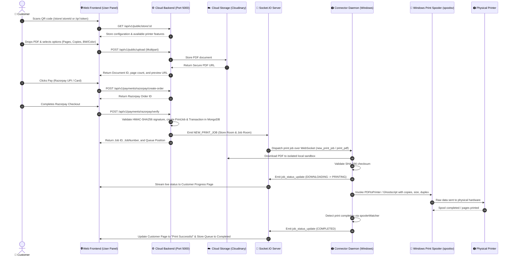

# SELFPRINT SYSTEM - Project Master Architecture Walkthrough

> **Scope**: Comprehensive, deep-dive system architecture, execution pipelines, data flows, communication protocols, security audits, failure modes, and integration roadmaps across both `selfprint` (Cloud SaaS Platform) and `selfprint-connector` (Windows Hardware Bridge & Desktop App).

---

## 1. Full Workspace Structure & Folder Purpose

```text
SELFPRINT SYSTEM/
├── selfprint/                             # Primary Cloud Platform Monorepo
│   ├── package.json                       # Monorepo root definition (workspaces: frontend, backend)
│   ├── backend/                           # Node.js + Express + TypeScript Core Engine
│   │   ├── prisma/                        # Legacy Prisma schema references
│   │   ├── scripts/                       # Database seeders (seedSuperAdmin.ts)
│   │   ├── src/
│   │   │   ├── config/                    # Environment variable parsing, Mongoose connector
│   │   │   ├── constants/                 # HTTP status codes, standard error constants
│   │   │   ├── controllers/               # BaseController abstractions
│   │   │   ├── database/                  # MongoDB lifecycle (connect, disconnect)
│   │   │   ├── errors/                    # AppError, BadRequestError, UnauthorizedError
│   │   │   ├── middlewares/               # authenticate, checkRole, apiLimiter, errorHandler
│   │   │   ├── models/                    # 19 Mongoose Models (Admin, Store, PrintJob, Txn, etc.)
│   │   │   ├── modules/                   # 13 Domain Feature Modules:
│   │   │   │   ├── admin/                 # Store oversight, staff invitations, KYC
│   │   │   │   ├── analytics/             # Financial & volumetric platform analytics
│   │   │   │   ├── audit/                 # Immutable security audit logs
│   │   │   │   ├── auth/                  # JWT auth, Google OAuth, activate invite
│   │   │   │   ├── notifications/         # Notification engine & alerts
│   │   │   │   ├── orders/                # Queue tracking, receipts, job status updates
│   │   │   │   ├── payments/              # Razorpay order generation & signature verify
│   │   │   │   ├── printer/               # Store printer registry & host bridge pairing
│   │   │   │   ├── public/                # Public pre-flight, PDF upload, server pricing
│   │   │   │   ├── qr/                    # Dynamic time-expiring QR generator
│   │   │   │   ├── store/                 # Store onboarding, dashboard, history, settings
│   │   │   │   ├── super-admin/           # Platform governance & overrides
│   │   │   │   └── user/                  # Customer kiosk session routes
│   │   │   ├── permissions/               # Dynamic RBAC matrix
│   │   │   ├── repositories/              # Generic BaseRepository
│   │   │   ├── responses/                 # Standardized ApiResponse wrapper
│   │   │   ├── routes/                    # API v1 router mounting all domain modules
│   │   │   ├── services/                  # EmailService (Nodemailer), BaseService
│   │   │   ├── socket/                    # SocketManager (Rooms: admin, store, job)
│   │   │   ├── storage/                   # Cloudinary / local storage abstraction
│   │   │   ├── utils/                     # PDF counter, JWT helper, logger, password hash
│   │   │   └── validators/                # Zod request payload validation schemas
│   │   ├── package.json
│   │   ├── tsconfig.json
│   │   └── .env
│   ├── frontend/                          # React 19 + Vite SPA (3 Sub-Applications)
│   │   ├── src/
│   │   │   ├── main.tsx                   # React root mount & providers
│   │   │   ├── routes/AppRoutes.tsx       # Route registry (Public, Store, Admin, Kiosk)
│   │   │   ├── user_pannel/               # Public Kiosk & Customer Print Portal (Zero Auth)
│   │   │   │   ├── components/            # DocumentUploadZone, PageSelector, PriceCard
│   │   │   │   ├── pages/                 # UserUploadPage, UserProgressPage
│   │   │   │   └── services/              # userPublic.service.ts
│   │   │   ├── store_pannel/              # Store Partner Dashboard & Queue Management
│   │   │   │   ├── components/            # Queue items, status cards, wizard steps
│   │   │   │   ├── hooks/                 # useStoreQueue, usePrinterMonitoring, useStoreQR
│   │   │   │   ├── pages/                 # Dashboard, Queue, QRGen, PrinterSetup, History
│   │   │   │   └── services/              # storeAuth, printer.service, storeQueue
│   │   │   ├── admin_pannel/              # SuperAdmin & Staff Operations (10+ sub-pages)
│   │   │   │   ├── components/            # Tables, modals, RBAC protected wrappers
│   │   │   │   ├── context/               # PermissionContext
│   │   │   │   ├── pages/                 # Stores, Users, Transactions, Revenue, Printers
│   │   │   │   └── services/              # Admin API services
│   │   │   ├── components/                # Shared UI primitives (Button, Modal, Card, Table)
│   │   │   ├── lib/                       # Axios client & TanStack Query client
│   │   │   └── types/                     # TypeScript global interfaces
│   │   ├── package.json
│   │   ├── tsconfig.json
│   │   └── vite.config.ts
│   └── host-service/                      # Standalone Local Express Bridge Prototype (Port 45120)
│       ├── src/
│       │   ├── detectors/                 # Windows PowerShell & Unix CUPS printer discovery
│       │   ├── server.ts                  # Local Express server (/api/v1/printers, /calibrate)
│       │   └── types.ts
│       ├── package.json
│       └── tsconfig.json
│
└── selfprint-connector/                   # Production Windows Hardware Bridge & Desktop App
    ├── installer/                         # Windows Deployment Scripts
    │   ├── install-service.ps1            # Windows Background Scheduled Task setup
    │   ├── install-startup.ps1            # User Startup folder installer
    │   ├── run-silent.vbs                 # VBS launcher for zero-window background execution
    │   ├── uninstall-service.ps1          # Service uninstaller
    │   └── uninstall-startup.ps1          # Startup cleanup
    ├── src/                               # Connector Background Daemon Engine
    │   ├── app.ts                         # Process bootstrapper & lifecycle traps
    │   ├── api/routes.ts                  # Local diagnostic REST API (Port 4500)
    │   ├── config/                        # Connector settings, environment & persistence
    │   ├── device/identity.ts             # Deterministic Machine UUID generator
    │   ├── printer/                       # Physical Hardware Interaction Subsystem
    │   │   ├── detectPrinters.ts          # WMI / PowerShell printer enumeration (<300ms)
    │   │   ├── jobDownloader.ts           # Sandboxed PDF downloader with hash checksum
    │   │   ├── jobExecutor.ts             # Native print pipeline (PDFtoPrinter / Ghostscript)
    │   │   ├── printerCache.ts            # In-memory printer diff engine
    │   │   ├── printerMapper.ts           # Device normalization & virtual printer filtering
    │   │   ├── printerStatus.ts           # Status mapping (ONLINE, OFFLINE, PAPER_JAM, etc.)
    │   │   ├── printHistory.ts            # Circular buffer for last 100 print jobs
    │   │   ├── spoolerControl.ts          # Spooler commands (pause, resume, restart, cancel)
    │   │   ├── spoolerWatcher.ts          # Active Windows Spooler queue monitoring
    │   │   └── watchPrinters.ts           # 30-second hardware change polling loop
    │   ├── queue/offlineQueue.ts          # Offline job persistence & auto-drain
    │   ├── recovery/crashRecovery.ts      # State checkpointing & recovery engine
    │   ├── services/                      # Heartbeat (15s), HealthMon (60s), Sync, Registration
    │   │   ├── healthMonitor.ts           # CPU, RAM, Disk, Spooler status collector
    │   │   ├── heartbeat.ts               # Heartbeat telemetry transmitter (REST + WS)
    │   │   ├── registration.service.ts    # Device pairing & token handshake
    │   │   └── sync.service.ts            # Watcher coordinator
    │   ├── storage/connectorStore.ts      # Persistent local settings (connector.json)
    │   ├── tray/trayManager.ts            # Windows System Tray companion
    │   ├── update/updateChecker.ts        # Architecture version update checker
    │   ├── utils/                         # Multi-level logger, rotating files, system metrics
    │   └── websocket/socket.ts            # WebSocket client with reconnect ladder
    ├── desktop/                           # Electron + React Desktop App
    │   ├── electron/
    │   │   ├── main.ts                    # Electron Main process (Window, Tray, IPC)
    │   │   └── preload.ts                 # Context bridge for renderer
    │   ├── src/
    │   │   ├── App.tsx                    # React UI Shell
    │   │   ├── store/useAppStore.ts       # Central Zustand store
    │   │   ├── pages/                     # DashboardPage, PrintersPage, ActivityPage, Settings
    │   │   └── services/                  # Local API & socket bridges
    │   ├── package.json
    │   ├── tsconfig.json
    │   └── vite.config.ts
    ├── docs/                              # Architecture, protocol, and flow documentation
    ├── package.json
    └── tsconfig.json
```

---

## 2. Technology Stack & Key Dependencies

| Project Subsystem | Core Technologies | Package Versions | Purpose |
| :--- | :--- | :--- | :--- |
| **Backend Core** | Node.js, Express, TypeScript, tsx | Node 22, Express ^4.21.2, TS ^5.7.3 | REST APIs, business logic, and security |
| **Backend DB** | MongoDB, Mongoose | Mongoose ^9.9.4 | Primary document store & data models |
| **Backend Real-Time** | Socket.IO | ^4.8.3 | Real-time bi-directional room broadcaster |
| **Backend Auth** | JWT, bcryptjs, google-auth-library | JWT ^9.0.2, bcryptjs ^3.0.3 | Tokens, password hashing, Google OAuth |
| **Backend Uploads** | Multer, Cloudinary, pdfjs-dist | Multer ^2.3.0, Cloudinary ^1.41.3 | File handling, cloud storage, page counts |
| **Frontend Core** | React, Vite, TypeScript | React ^19.0.0, Vite ^6.1.0 | Fast single page application architecture |
| **Frontend UI/State**| TailwindCSS, Framer Motion, TanStack Query | Tailwind ^3.4.17, Query ^5.66.0, FM ^13.1.1 | Modern responsive styling & server state |
| **Connector Core** | Node.js, TypeScript, ts-node | Node 20, ts-node ^10.9.2 | Windows background execution engine |
| **Connector Desktop**| Electron, React, Zustand | Electron ^34.2.0, React ^18.3.1, Zustand ^5.0.3 | Native Windows desktop GUI & Tray companion |
| **Connector Spooler**| PowerShell WMI (`Win32_Printer`), PDFtoPrinter | Native Windows OS CLI | Hardware printer discovery & execution |

---

## 3. Entry Points Across the Ecosystem

1. **Backend Server**: [`selfprint/backend/src/server.ts`](file:///d:/project/SELFPRINT%20SYSTEM/selfprint/backend/src/server.ts)
   - Connects to MongoDB -> Verifies SMTP email -> Starts Express on `0.0.0.0:5000` -> Initializes `socketManager`.
2. **Frontend Web App**: [`selfprint/frontend/src/main.tsx`](file:///d:/project/SELFPRINT%20SYSTEM/selfprint/frontend/src/main.tsx) & [`AppRoutes.tsx`](file:///d:/project/SELFPRINT%20SYSTEM/selfprint/frontend/src/routes/AppRoutes.tsx)
   - Mounts QueryClientProvider, React Router DOM, and central routing table.
3. **Host Service**: [`selfprint/host-service/src/server.ts`](file:///d:/project/SELFPRINT%20SYSTEM/selfprint/host-service/src/server.ts)
   - Express server listening on `127.0.0.1:45120` for printer discovery during development.
4. **Connector Daemon**: [`selfprint-connector/src/app.ts`](file:///d:/project/SELFPRINT%20SYSTEM/selfprint-connector/src/app.ts)
   - Traps process errors -> Runs crash recovery -> Registers device -> Starts local REST on `127.0.0.1:4500` -> Connects WebSocket client -> Starts 15s heartbeat & 60s health telemetry -> Spawns System Tray.
5. **Desktop Electron App**: [`selfprint-connector/desktop/electron/main.ts`](file:///d:/project/SELFPRINT%20SYSTEM/selfprint-connector/desktop/electron/main.ts)
   - Creates BrowserWindow with frameless TitleBar, loads Vite/React renderer, configures IPC bridge.

---

## 4. End-to-End Data & Print Execution Flow



---

## 5. Communication Channels Matrix

| Communication Path | Transport | Source | Target | Purpose |
| :--- | :--- | :--- | :--- | :--- |
| **Client REST API** | HTTPS / JSON | Web Browser (Frontend) | Cloud Backend (`:5000`) | Uploads, pricing, auth, onboarding, settings |
| **Client WebSocket**| WSS (Socket.IO) | Web Browser (Frontend) | Cloud Backend (`:5000`) | Live queue changes, customer progress streaming |
| **Connector Cloud WS**| WSS (Socket.IO) | Connector Daemon | Cloud Backend (`:5000`) | Print command delivery, hardware status, telemetry |
| **Connector Heartbeat**| HTTPS POST / WSS| Connector Daemon | Cloud Backend (`:5000`) | 15s heartbeat telemetry & 60s health metrics |
| **Desktop Local API**| HTTP (`127.0.0.1:4500`)| Desktop App / Local UI| Connector Daemon | Local diagnostic inspection, rescan, pause/resume |
| **Dev Host Bridge** | HTTP (`127.0.0.1:45120`)| Web Browser (Store) | `host-service` | Browser printer discovery during dev testing |
| **Electron IPC** | Native IPC (`preload`)| Desktop React Renderer| Electron Main Process | Minimize, maximize, close, native tray interactions |

---

## 6. Complete API & Socket Event Map

### A. REST APIs Map
```text
/api/v1/public
  GET  /store/:identifier              -> Fetch store details, pricing rules, hardware status
  POST /calculate-price                -> Server-side price calculation
  POST /upload                         -> Document upload & PDF page count

/api/v1/payments
  POST /razorpay/create-order          -> Initialize Razorpay transaction
  POST /razorpay/verify                -> Verify payment signature & queue PrintJob

/api/v1/orders
  GET  /:id/track                      -> Real-time customer queue tracking & wait time
  GET  /:id/receipt                    -> Tax invoice & receipt payload
  GET  /:orderId                       -> Get single order status
  PATCH /:id/status                    -> Store staff manual status override
  DELETE /:id                          -> Remove job from queue
  POST /clear-completed                -> Clear finished jobs

/api/v1/qr
  POST /generate                       -> Create dynamic time-expiring QR
  GET  /validate/:token                -> Resolve store from scanned QR token
  GET  /history                        -> List generated QR posters
  POST /revoke/:token                  -> Invalidate active QR

/api/v1/printer
  GET  /store                          -> List configured store printers
  POST /save                           -> Save printer hardware capabilities
  PATCH /:id/status                    -> Set printer status (ONLINE, PAUSED, OFFLINE)
  DELETE /:id                          -> Delete printer profile
  POST /host/pair                      -> Pair local host machine with store
  POST /host/heartbeat                 -> Ingest heartbeat telemetry

/api/v1/store
  POST /auth/login                     -> Store partner authentication
  POST /auth/onboarding                -> Multi-step partner onboarding application
  GET  /dashboard/stats                -> Store revenue KPIs and job counters
  GET  /history                        -> Store transaction & print history
  GET  /settings & PUT /settings       -> Store pricing rules & operational settings
  PATCH /first-login-completed         -> Complete initial printer setup wizard

/api/v1/auth & /api/v1/super-admin
  POST /auth/login                     -> SuperAdmin & Staff login
  POST /auth/activate                  -> Staff invite token activation
  GET  /super-admin/dashboard          -> Global platform analytics
  GET  /super-admin/stores             -> Store approval queue
  PATCH /super-admin/stores/:id/approve-> Approve pending store application
  GET  /audit/logs                     -> Security audit trail
```

### B. Socket.IO Event Map

```text
CLOUD BACKEND EMITS:
  NEW_PRINT_JOB           -> Emitted to room `store:<storeId>` when payment succeeds
  JOB_STATUS_CHANGED      -> Emitted to `job:<jobId>` and `store:<storeId>`
  QUEUE_UPDATED           -> Emitted when queue positions advance
  PRINTER_STATUS_CHANGED  -> Emitted when printer hardware state changes

CONNECTOR EMITS:
  connector_online        -> Handshake containing connector version, machine ID, hostname
  hardware_ready          -> Full snapshot of all discovered physical printers
  job_status_update       -> Live job progress (DOWNLOADING, PRINTING, COMPLETED, FAILED)
  printer_added/removed   -> Hardware delta events
  printer_online/offline  -> State changes
  paper_changed           -> Tray alerts (PAPER_JAM, EMPTY)
  toner_changed           -> Cartridge alerts (LOW, EMPTY)
  heartbeat               -> 15s health telemetry (CPU, RAM, Spooler, Active Queue)

CONNECTOR RECEIVES:
  print_pdf / new_print_job -> Dispatches execution pipeline for cloud job
  cancel_job              -> Aborts active spool or removes from queue
  pause_printer / resume_printer -> Controls Windows print spooler
  refresh_printers / rescan      -> Forces immediate WMI hardware scan
  update_config           -> Hot reloads intervals and backend URL without daemon restart
  restart_connector       -> Reboots daemon process
```

---

## 7. Database Architecture (19 Mongoose Collections)

1. **`users`**: Customer profiles and print volume history.
2. **`admins`**: SuperAdmins and internal operations executives.
3. **`staff`**: Store operators with invite lifecycle tokens (`INVITED`, `ACTIVE`, `SUSPENDED`).
4. **`roles`**: Granular RBAC definitions and module permission matrices.
5. **`invitations`**: Time-limited cryptographic staff invitation links.
6. **`stores`**: Physical store partner profiles (`PENDING_APPROVAL`, `APPROVED`, `SUSPENDED`).
7. **`storeSettings`**: Store pricing models (BW rate, Color rate, duplex discount).
8. **`storeBankAccounts`**: Bank details for automated payout settlements.
9. **`storeDashboardStats`**: Materialized performance caches.
10. **`storeNotifications`**: In-app operational alerts.
11. **`printers`**: Configured hardware printers per store with capabilities.
12. **`hosts`**: Paired connector host machines.
13. **`printJobs`**: Central order document (jobNumber, fileUrl, pages, copies, colorMode, status).
14. **`transactions`**: Payment transactions with platform commission splits and settlement status.
15. **`qrLinks`**: Dynamic QR records with validity timestamps and scan counters.
16. **`qrHistories`**: Historical log of printed QR posters.
17. **`auditLogs`**: Security audit records (userId, action, module, IP, changes).
18. **`tickets`**: Customer and store support tickets.
19. **`platformSettings`**: Global platform settings (commissions, Razorpay credentials, maintenance mode).

---

## 8. Critical System Analysis: Flaws, Risks & Missing Integrations

### A. Architectural & Integration Misalignments

1. **Connector Registration Endpoint 404 Bug**:
   - Connector [`registration.service.ts`](file:///d:/project/SELFPRINT%20SYSTEM/selfprint-connector/src/services/registration.service.ts#L41) calls `POST /api/v1/connectors/register`.
   - Connector [`heartbeat.ts`](file:///d:/project/SELFPRINT%20SYSTEM/selfprint-connector/src/services/heartbeat.ts#L68) calls `POST /api/v1/connectors/heartbeat`.
   - Backend [`routes/index.ts`](file:///d:/project/SELFPRINT%20SYSTEM/selfprint/backend/src/routes/index.ts) does **NOT** mount `/connectors`! It only mounts `/printer` (`/api/v1/printer/host/pair` and `/api/v1/printer/host/heartbeat`).
   - *Production Impact*: Connector HTTP registration and REST heartbeat fail with 404 errors on every cycle.
2. **Socket Event Casing & Payload Mismatch**:
   - Backend [`payments/index.ts`](file:///d:/project/SELFPRINT%20SYSTEM/selfprint/backend/src/modules/payments/index.ts#L159) emits uppercase `NEW_PRINT_JOB` with `{ job: newJob.toObject(), queuePosition }`.
   - Connector [`socket.ts`](file:///d:/project/SELFPRINT%20SYSTEM/selfprint-connector/src/websocket/socket.ts#L238-L239) listens for `print_pdf` and `new_print_job` (lowercase) expecting top-level `{ jobId, fileUrl, printerId, copies, paperSize, colorMode }`.
   - *Production Impact*: Automated printing does not trigger on payment verification unless the event name and payload structure are normalized.
3. **Local Bridge Port Disconnect**:
   - Store Panel [`printer.service.ts`](file:///d:/project/SELFPRINT%20SYSTEM/selfprint/frontend/src/store_pannel/services/printer.service.ts#L8) hardcodes `http://127.0.0.1:45120` (`host-service`).
   - Connector [`routes.ts`](file:///d:/project/SELFPRINT%20SYSTEM/selfprint-connector/src/api/routes.ts#L35) listens on port `4500`.
   - *Production Impact*: The store setup wizard cannot discover printers if only the production `selfprint-connector` is running.
4. **Socket Room Joining for Connector**:
   - Connector connects to Socket.IO without joining `store:<storeId>` room.
   - Backend emits `socketManager.broadcastToStore(storeId, ...)` to `store:<storeId>`.
   - *Production Impact*: The connector does not receive store-targeted print events unless it joins the store room upon authentication.

---

### B. Security Flaws

1. **Fallback Hardcoded JWT Secret & Credentials**:
   - Backend [`environment.ts`](file:///d:/project/SELFPRINT%20SYSTEM/selfprint/backend/src/config/environment.ts#L69-L80) has fallback default values for `JWT_SECRET`, `SMTP_PASS`, etc.
   - *Remediation*: Enforce strict runtime failure in production if critical environment variables are absent.
2. **Local REST API Missing Origin / Token Guard**:
   - Connector [`api/routes.ts`](file:///d:/project/SELFPRINT%20SYSTEM/selfprint-connector/src/api/routes.ts#L43) sets `Access-Control-Allow-Origin: *` for local endpoints without verifying authorization tokens.
   - *Remediation*: Bind local API strictly to `127.0.0.1` and require an authorization token or handshake secret.

---

### C. Scalability & Operational Bottlenecks

1. **Single-Node Socket.IO Adapter**:
   - Backend Socket.IO operates in-memory without a Redis adapter. Scaling backend to multiple instances (e.g. Kubernetes / AWS ECS) will drop real-time events across nodes.
2. **Unbounded Temp Directory Usage**:
   - Connector downloads PDFs to `temp/jobs/`. If cleanup fails after an aborted print job, disk space can accumulate over time.
3. **Database Polling on Queue Position**:
   - Queue positions are calculated via `countDocuments` queries on every request. High concurrency stores should utilize Redis sorted sets or indexed sequence counters.

---

## 9. Code Locations to Modify (Without Breaking Either Project)

| Module | Exact File Path | Modification Plan |
| :--- | :--- | :--- |
| **Backend Connectors Route** | [`selfprint/backend/src/routes/index.ts`](file:///d:/project/SELFPRINT%20SYSTEM/selfprint/backend/src/routes/index.ts) | Mount `/api/v1/connectors` alias routing to `printerController.pairHost` and `printerController.processHeartbeat` to satisfy connector expectations. |
| **Backend Socket Dispatch** | [`selfprint/backend/src/modules/payments/index.ts`](file:///d:/project/SELFPRINT%20SYSTEM/selfprint/backend/src/modules/payments/index.ts#L159) | Standardize event emission: emit both `NEW_PRINT_JOB` (for Store Queue UI) and `print_pdf` / `new_print_job` with formatted payload `{ jobId, fileUrl, printerName, copies, paperSize, colorMode }`. |
| **Connector Room Join** | [`selfprint-connector/src/websocket/socket.ts`](file:///d:/project/SELFPRINT%20SYSTEM/selfprint-connector/src/websocket/socket.ts#L66) | On connect, emit `join_store` with `connectorStore.getData().storeId` so the connector receives store-scoped broadcasts. |
| **Connector Event Aliases** | [`selfprint-connector/src/websocket/socket.ts`](file:///d:/project/SELFPRINT%20SYSTEM/selfprint-connector/src/websocket/socket.ts#L238) | Add handler for `NEW_PRINT_JOB` mapping payload `data.job` fields seamlessly. |
| **Frontend Local Bridge** | [`selfprint/frontend/src/store_pannel/services/printer.service.ts`](file:///d:/project/SELFPRINT%20SYSTEM/selfprint/frontend/src/store_pannel/services/printer.service.ts#L8) | Implement port probe checking both `4500` and `45120`, falling back gracefully. |
| **Connector Cleanup Trap** | [`selfprint-connector/src/printer/jobExecutor.ts`](file:///d:/project/SELFPRINT%20SYSTEM/selfprint-connector/src/printer/jobExecutor.ts) | Add `finally` block ensuring sandboxed temp PDFs are purged immediately upon job completion, failure, or cancellation. |

---

## 10. Summary & Conclusion

Both projects have high-quality foundations:
- **`selfprint`**: Clean, enterprise-grade architecture with strict TypeScript typing, modular controllers, comprehensive Mongoose schemas, and rich React 19 UI.
- **`selfprint-connector`**: Production-ready Windows daemon with exponential backoff reconnect ladders, crash recovery, rotating logs, health monitors, and Electron desktop GUI.

By resolving the 4 bridge discrepancies (registration route alias, socket event name/payload standardization, store room joining, and local bridge port probe), the two systems will achieve seamless, resilient, end-to-end cloud-to-hardware automated printing.
