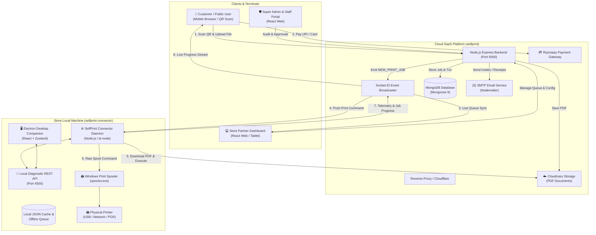
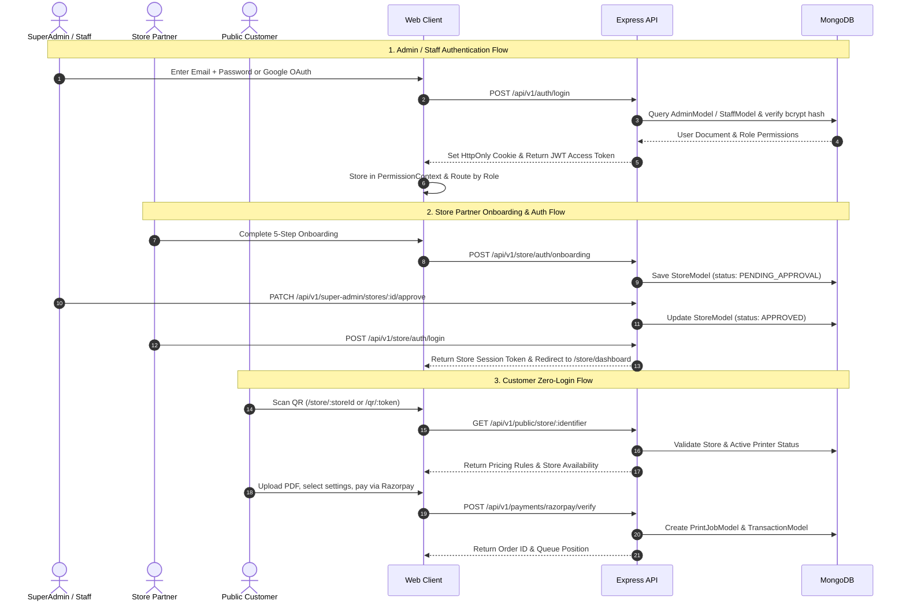
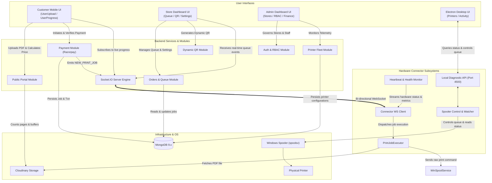

# Complete System Walkthrough: SELFPRINT SYSTEM

> Workspace Analysis: `selfprint/` (Cloud SaaS Platform) & `selfprint-connector/` (Windows Hardware Bridge & Desktop Client)

---

## 1. Overall Folder Structure

```text
SELFPRINT SYSTEM/
├── selfprint/                             # Cloud SaaS Platform Root
│   ├── backend/                           # Node.js + Express + TypeScript API & WebSocket Server
│   │   ├── prisma/                        # Prisma schema & migration definitions (legacy / reference)
│   │   ├── scripts/                       # Database seeding & utility scripts
│   │   │   └── seedSuperAdmin.ts
│   │   ├── src/
│   │   │   ├── config/                    # Environment, database, and system configs
│   │   │   ├── constants/                 # HTTP status codes, error messages, roles
│   │   │   ├── controllers/               # BaseController & shared controllers
│   │   │   ├── database/                  # MongoDB connection & disconnect handlers
│   │   │   ├── errors/                    # Custom AppError & standard error classes
│   │   │   ├── middlewares/               # Auth, RBAC, rate-limiting, error handling
│   │   │   ├── models/                    # 19 Mongoose Models (Admin, Store, Job, etc.)
│   │   │   ├── modules/                   # Domain modules
│   │   │   │   ├── admin/                 # Admin management & staff operations
│   │   │   │   ├── analytics/             # Platform & store metrics
│   │   │   │   ├── audit/                 # Security & operational audit logs
│   │   │   │   ├── auth/                  # JWT auth, Google OAuth, activate invite
│   │   │   │   ├── notifications/         # Notification dispatchers
│   │   │   │   ├── orders/                # Print orders queue & tracking
│   │   │   │   ├── payments/              # Razorpay order creation & signature verification
│   │   │   │   ├── printer/               # Store printer config & host bridge pairing
│   │   │   │   ├── public/                # Public store preflight, upload, price calc
│   │   │   │   ├── qr/                    # Dynamic QR code generation & validation
│   │   │   │   ├── store/                 # Store settings, onboarding, dashboard, history
│   │   │   │   ├── super-admin/           # Platform governance & store approvals
│   │   │   │   └── user/                  # Customer kiosk session routes
│   │   │   ├── permissions/               # Permission mappings & RBAC rules
│   │   │   ├── repositories/              # BaseRepository & generic data access
│   │   │   ├── responses/                 # Standardized ApiResponse wrapper
│   │   │   ├── routes/                    # API v1 central router & health check
│   │   │   ├── services/                  # EmailService, BaseService, Nodemailer
│   │   │   ├── socket/                    # Socket.IO manager & real-time event broadcasting
│   │   │   ├── storage/                   # Cloudinary / local storage abstraction
│   │   │   ├── utils/                     # PDF page counter, JWT, logger, password hash
│   │   │   └── validators/                # Request validation middleware (Zod)
│   │   ├── package.json
│   │   ├── tsconfig.json
│   │   └── .env
│   ├── frontend/                          # React 19 + Vite Single Page Application
│   │   ├── public/                        # Static assets, favicon, logos
│   │   ├── src/
│   │   │   ├── admin_pannel/              # SuperAdmin & Staff Dashboard (10+ sub-pages)
│   │   │   │   ├── components/            # Data tables, stats cards, modals, RBAC guards
│   │   │   │   ├── context/               # PermissionContext & Auth state
│   │   │   │   ├── pages/                 # Stores, Users, Transactions, Revenue, Printers, etc.
│   │   │   │   └── services/              # Admin API services
│   │   │   ├── store_pannel/              # Store Partner Portal
│   │   │   │   ├── components/            # Queue items, status cards, wizard steps
│   │   │   │   ├── hooks/                 # Real-time queue, printer monitoring, session hooks
│   │   │   │   ├── pages/                 # Dashboard, Queue, QRGen, PrinterSetup, History
│   │   │   │   └── services/              # Store auth, printer discovery, queue management
│   │   │   ├── user_pannel/               # Public Kiosk & Customer Print Portal
│   │   │   │   ├── components/            # DocumentUploadZone, PageSelector, PriceCard, etc.
│   │   │   │   ├── pages/                 # UserUploadPage, UserProgressPage
│   │   │   │   └── services/              # Public store API & upload service
│   │   │   ├── components/                # Shared UI primitives (Button, Modal, Card, Table)
│   │   │   ├── lib/                       # Axios instance & React Query client
│   │   │   ├── routes/                    # AppRoutes (Central route registry)
│   │   │   └── types/                     # Global TypeScript interfaces
│   │   ├── package.json
│   │   ├── tsconfig.json
│   │   └── vite.config.ts
│   └── host-service/                      # Standalone Local Express Printer Bridge (Port 45120)
│       ├── src/
│       │   ├── detectors/                 # Windows PowerShell & Unix CUPS printer discovery
│       │   ├── server.ts                  # Local Express server (/api/v1/printers, /calibrate)
│       │   └── types.ts
│       ├── package.json
│       └── tsconfig.json
│
└── selfprint-connector/                   # Production Windows Hardware Bridge & Desktop App
    ├── desktop/                           # Electron + React Desktop App
    │   ├── electron/                      # Electron Main process & Preload script
    │   │   ├── main.ts                    # Window management, tray integration, IPC handlers
    │   │   └── preload.ts                 # Context bridge for renderer
    │   ├── src/                           # React Renderer for Desktop UI
    │   │   ├── components/                # TitleBar, Sidebar, ToastContainer, Cards
    │   │   ├── pages/                     # DashboardPage, PrintersPage, ActivityPage, Settings
    │   │   ├── services/                  # Socket.io client & local API bridge
    │   │   └── store/                     # Zustand application store (useAppStore)
    │   ├── package.json
    │   ├── tsconfig.json
    │   └── vite.config.ts
    ├── installer/                         # Windows Deployment Scripts
    │   ├── install-service.ps1            # Windows Background Scheduled Task / Service setup
    │   ├── install-startup.ps1            # User Startup directory installer
    │   ├── run-silent.vbs                 # VBS launcher for zero-window background execution
    │   ├── uninstall-service.ps1          # Service cleanup
    │   └── uninstall-startup.ps1          # Startup cleanup
    ├── src/                               # Connector Background Daemon Engine
    │   ├── api/                           # Diagnostic Local REST API (Port 4500)
    │   │   └── routes.ts                  # /health, /printers, /jobs/history, /rescan, /diagnostics
    │   ├── config/                        # Connector settings, environment & config persistence
    │   ├── device/                        # Stable Machine UUID & Hardware Identity generator
    │   ├── logs/                          # Dedicated rotating log handlers
    │   ├── printer/                       # Physical Hardware Interaction Subsystem
    │   │   ├── detectPrinters.ts          # WMI / PowerShell printer enumeration (<300ms)
    │   │   ├── jobDownloader.ts           # Sandboxed PDF downloader with hash checksum verification
    │   │   ├── jobExecutor.ts             # PDFtoPrinter / Ghostscript / RAW spool execution
    │   │   ├── printerCache.ts            # In-memory printer diff engine
    │   │   ├── printerMapper.ts           # Device normalization & virtual printer filtering
    │   │   ├── printerStatus.ts           # Status mapping (ONLINE, OFFLINE, PAPER_JAM, LOW_TONER)
    │   │   ├── printHistory.ts            # Circular buffer for last 100 print jobs
    │   │   ├── spoolerControl.ts          # Spooler commands (pause, resume, restart, cancel)
    │   │   ├── spoolerWatcher.ts          # Real-time spooler queue monitoring
    │   │   └── watchPrinters.ts           # 30-second hardware change polling loop
    │   ├── queue/                         # Offline queueing & persistent disk recovery
    │   │   └── offlineQueue.ts
    │   ├── recovery/                      # Crash recovery checkpoints
    │   │   └── crashRecovery.ts
    │   ├── services/                      # Heartbeat (15s), Health Monitor (60s), Sync, Registration
    │   │   ├── healthMonitor.ts           # CPU, RAM, Disk, Spooler status collector
    │   │   ├── heartbeat.ts               # Heartbeat telemetry transmitter
    │   │   ├── registration.service.ts    # Device pairing & token handshake
    │   │   └── sync.service.ts            # Coordinator for watchers
    │   ├── storage/                       # Local JSON store (connector.json)
    │   │   └── connectorStore.ts
    │   ├── tray/                          # Windows System Tray companion
    │   │   └── trayManager.ts
    │   ├── update/                        # Architecture version update checker
    │   │   └── updateChecker.ts
    │   ├── utils/                         # Multi-level logger, rotating files, system metrics
    │   └── websocket/                     # WebSocket bridge with reconnection ladder
    │       └── socket.ts
    ├── docs/                              # Comprehensive architecture & protocol documentation
    ├── package.json
    ├── tsconfig.json
    └── .env.example
```

---

## 2. Technology Stack Used in Both Projects

### A. `selfprint/` (Cloud SaaS Platform)

| Component | Technology | Version | Purpose |
| :--- | :--- | :--- | :--- |
| **Backend Runtime** | Node.js (TypeScript) + `tsx` | 22.x / 5.7 | High-performance async runtime |
| **Web Framework** | Express.js | ^4.21.2 | REST API routing and middleware pipeline |
| **Real-Time Layer** | Socket.IO Server | ^4.8.3 | Bi-directional event broadcasting to Store & User panels |
| **Database** | MongoDB + Mongoose | ^9.9.4 | Primary document database and schema validation |
| **Security & Auth** | JWT (`jsonwebtoken`), `bcryptjs`, Helmet | ^9.0.2 / ^3.0.3 | Token-based authentication, password hashing, secure headers |
| **File Storage & Parsing**| Multer, Cloudinary (`multer-storage-cloudinary`), `pdfjs-dist` | ^2.3.0 / ^1.41.3 | Document upload, cloud asset storage, PDF page counting |
| **Email Service** | Nodemailer | ^9.1.1 | Transactional HTML email dispatching (SMTP / Gmail) |
| **Validation** | Zod, `express-validator` | ^4.5.4 / ^7.2.1 | Strict schema validation for incoming payloads |
| **Frontend Framework**| React | ^19.0.0 | User interface component architecture |
| **Build Tool** | Vite | ^6.1.0 | Fast HMR dev server and ES module bundler |
| **Routing** | React Router DOM | ^7.1.5 | Client-side routing with RBAC guards |
| **State & Data Fetching**| TanStack React Query | ^5.66.0 | Server-state caching and synchronization |
| **Styling & Animation** | TailwindCSS + Framer Motion + Lucide | ^3.4.17 / ^13.1.1 | Modern responsive UI, micro-animations, iconography |
| **Host Service** | Standalone Express | ^4.21.2 | Port 45120 local printer discovery bridge |

---

### B. `selfprint-connector/` (Windows Hardware Bridge & Desktop App)

| Component | Technology | Version | Purpose |
| :--- | :--- | :--- | :--- |
| **Daemon Runtime** | Node.js (TypeScript) + `ts-node` | 20.x / 5.7 | Windows background execution engine |
| **Desktop Shell** | Electron | ^34.2.0 | Native Windows application window and System Tray manager |
| **Desktop UI** | React 18 + Vite + TailwindCSS | ^18.3.1 / ^6.1.0 | Desktop status dashboard & hardware config UI |
| **State Management** | Zustand | ^5.0.3 | Client state for desktop app |
| **Cloud Bridge** | `socket.io-client` | ^4.8.1 | Real-time WebSocket connection to Cloud Backend |
| **Local API** | Node.js native `http` module | Native | Port 4500 zero-dependency diagnostic REST server |
| **Windows Spooler** | PowerShell (WMI `Win32_Printer`, `spoolsv`) | Native | Hardware discovery, job cancellation, spool control |
| **Print Execution** | `PDFtoPrinter.exe` / Ghostscript / Native CLI | Native / Binary | Direct physical print dispatching with hardware parameters |

---

## 3. Architecture Diagram



---

## 4. Backend Modules (`selfprint/backend`)

The backend is structured into modular domain controllers, services, repositories, and routes:

1. **`auth`**: Authentication and sessions. Handles Admin/Staff login, Google OAuth verification, password hashing, token validation, and staff account activation invitations.
2. **`super-admin`**: SuperAdmin governance. Manages platform statistics, store onboarding approvals, partner KYC verification, commission configuration, and system-wide overrides.
3. **`admin`**: Staff and store administration. Manages store entities, staff users, invitations, activity monitoring, and store settings.
4. **`store`**: Complete Store Partner domain:
   - `dashboard`: Real-time analytics, revenue calculation, printer health summary, queue counts.
   - `history`: Paginated transaction and print job historical records.
   - `settings`: Store configuration, business hours, pricing rules, bank accounts for payouts.
   - `onboarding`: Multi-step partner onboarding (Welcome -> Details -> Bank -> Review -> Approval).
5. **`orders`**: Print queue pipeline. Handles order creation, job tracking (`/api/v1/orders/:id/track`), receipt retrieval (`/api/v1/orders/:id/receipt`), status updates, and queue clearance.
6. **`payments`**: Payment processing. Razorpay order initialization (`/razorpay/create-order`), cryptographic HMAC-SHA256 signature verification (`/razorpay/verify`), automated PrintJob creation, and Transaction logging.
7. **`printer`**: Store printer registry. Manages printer registration, capability saving (color, duplex, paper sizes), status changes, and host heartbeat telemetry ingest.
8. **`qr`**: Dynamic QR generation. Generates time-bounded cryptographic QR links (`/api/v1/qr/generate`), validates scans, tracks scan counters, and enforces expiry windows.
9. **`public`**: Zero-auth customer kiosk portal. Validates store availability by storeCode or QR token, performs server-side page-count extraction and price calculations, and handles multipart PDF uploads.
10. **`notifications`**: Real-time store alerts and system notifications.
11. **`audit`**: Comprehensive security auditing. Logs IP addresses, user agents, action categories, before/after states, and risk levels.
12. **`analytics`**: Business intelligence, store performance metrics, revenue charts, and usage reports.
13. **`user`**: Legacy / kiosk user session helpers.

---

## 5. Frontend Modules (`selfprint/frontend`)

The frontend contains three distinct sub-applications built in React 19:

### A. User Panel (`/src/user_pannel`) — Public Customer Flow
- Zero login required. Customer scans QR code or visits `/store/:storeId`.
- **`UserUploadPage`**: Drag-and-drop document upload zone, live PDF thumbnail rendering via `pdfjs-dist`, page range selector, color/BW toggle, paper size picker, and real-time pricing calculation.
- **`PaymentReviewModal`**: Razorpay checkout integration with instant UPI QR / netbanking.
- **`UserProgressPage`**: Interactive print progress viewer featuring live stage progress (`Uploading` -> `Processing` -> `Spooling` -> `Printing` -> `Completed`), queue position counter, estimated wait time, frame-by-frame animation, and downloadable invoice receipt.

### B. Store Panel (`/src/store_pannel`) — Store Partner Operations
- Protected by `StoreAuthGuard`.
- **`StoreLoginPage` & `StoreOnboardingPage`**: 5-step onboarding flow for new print shop partners.
- **`Dashboard`**: High-level store metrics (Today's revenue, active queue count, printer health status, quick links).
- **`QueuePage`**: Real-time print queue. Live WebSocket updates for new print requests, job status overrides, manual spool triggers, and error recovery.
- **`QRGenerationPage`**: Dynamic kiosk QR generator with configurable validity durations (10m, 30m, 1h, 24h, Permanent), live expiration countdown timer, and printable PDF posters.
- **`PrinterSetupPage`**: Hardware detection wizard interfacing with local host service, automated driver/spool verification, calibration tests, and default printer settings.
- **`TransactionHistoryPage` & `SettingsPage`**: Financial records, daily settlements, payout details, and store profile.

### C. Admin Panel (`/src/admin_pannel`) — SuperAdmin & Staff Operations
- Protected by `AdminProtectedRoute` and dynamic RBAC `PermissionProvider`.
- **`AdminDashboardPage`**: Enterprise KPIs, platform GMV, active stores, print job volume.
- **`AdminStoresPage`**: Store management, approval workflow, document verification, status suspension.
- **`AdminUsersPage` & `AdminAccessControlPage`**: Staff invitation manager, role assignments, granular permissions.
- **`AdminTransactionsPage` & `AdminRevenuePage`**: Global settlement ledger, platform commission splits, refund management.
- **`AdminPrintersPage`**: Fleet telemetry, hardware health monitoring across all partner stores.
- **`AdminAuditLogsPage` & `AdminSupportPage`**: Immutable security logs and support ticket escalation.

---

## 6. Connector Architecture (`selfprint-connector/src`)

The connector is a resilient, autonomous Windows service designed for unattended operation:

```text
               +-------------------------------------------+
               |           connectorStore (State)          |
               +-------------------------------------------+
                                     ^
                                     |
+------------------------------------+------------------------------------+
|                                    |                                    |
v                                    v                                    v
+------------------+       +-------------------+       +------------------+
|  Hardware Layer  |       |   Network Layer   |       |  Reliability     |
+------------------+       +-------------------+       +------------------+
| detectPrinters   |       | WebSocket Bridge  |       | crashRecovery    |
| spoolerWatcher   |       | (Reconnect Ladder)|       | offlineQueue     |
| spoolerControl   |       | Local REST API    |       | rotatingLogger   |
| jobDownloader    |       | Heartbeat (15s)   |       | updateChecker    |
| jobExecutor      |       | HealthMon (60s)   |       | trayManager      |
+------------------+       +-------------------+       +------------------+
```

### Key Subsystems:
1. **Device Identity (`identity.ts`)**: Generates deterministic machine GUIDs via Windows Registry (`MachineGuid`) and MAC address hashing to ensure persistent hardware identity across reboots.
2. **Printer Detection & Watcher (`detectPrinters.ts`, `watchPrinters.ts`)**: Uses PowerShell WMI commands (`Get-CimInstance Win32_Printer`) with a 300ms execution target. Polls hardware every 30 seconds and calculates delta diffs (`added`, `removed`, `statusChanged`, `defaultChanged`).
3. **Print Execution Engine (`jobExecutor.ts`, `jobDownloader.ts`)**:
   - Downloads PDF to a secure sandbox directory with SHA-256 checksum verification.
   - Dispatches print instructions to Windows Spooler using `PDFtoPrinter.exe` or Ghostscript with parameters: copies, paper size, duplex, orientation, and page range.
   - Monitors spool progress and streams updates: `DOWNLOADING` -> `READY` -> `PRINTING` -> `PAGE_PROGRESS` -> `COMPLETED` / `FAILED`.
4. **Spooler Controller (`spoolerControl.ts`)**: Direct control over Windows spooler jobs: `pausePrinter`, `resumePrinter`, `restartPrinter`, and `cancelJob`.
5. **Offline Queue (`offlineQueue.ts`)**: If the internet or cloud backend drops during print execution, jobs are persisted to `offline-queue.json` and auto-drained upon reconnect.
6. **Crash Recovery (`crashRecovery.ts`)**: Maintains atomic checkpoint files on disk to recover interrupted jobs and reconcile pending sync states after unexpected power cuts.
7. **Health Monitor & Heartbeat (`healthMonitor.ts`, `heartbeat.ts`)**: Collects CPU, RAM, Disk, Latency, and Spooler health every 60s and transmits it to the cloud in a 15s heartbeat payload.

---

## 7. Desktop UI Architecture (`selfprint-connector/desktop`)

Built as a lightweight Electron desktop companion for store owners who prefer a desktop GUI:

- **Electron Main Process (`electron/main.ts`)**: Manages the desktop window lifecycle, frameless native TitleBar, system tray minimization, IPC communication, and single-instance locks.
- **Preload Bridge (`electron/preload.ts`)**: Context-isolated bridge exposing safe APIs to the React renderer:
  - `window.electronAPI.minimize()`, `maximize()`, `close()`
  - `window.electronAPI.getAppVersion()`, `openExternal(url)`
- **Zustand Store (`src/store/useAppStore.ts`)**: Central state container synchronizing connected status, active printers list, job history buffer, and telemetry metrics.
- **Desktop UI Views**:
  - `DashboardPage`: Quick stats, connection status indicator, default printer tile, recent jobs.
  - `PrintersPage`: Grid of installed printers with live status tags (Ready, Paused, Error) and spooler action buttons (Pause, Resume, Rescan).
  - `ActivityPage`: Real-time audit log of printed documents with status filters.
  - `SettingsPage`: Local port configuration, backend URL endpoint, log level overrides.

---

## 8. API Endpoints

### A. Cloud Backend (`selfprint/backend` on Port 5000)

#### Public Customer & Pre-Flight
- `GET  /api/v1/public/store/:identifier` — Fetch store metadata & hardware availability
- `POST /api/v1/public/calculate-price` — Calculate exact price server-side
- `POST /api/v1/public/upload` — Multipart document upload & page extraction

#### Dynamic QR System
- `POST /api/v1/qr/generate` — Generate dynamic time-bounded QR token (Auth Required)
- `GET  /api/v1/qr/validate/:token` — Validate scanned QR token & resolve store
- `GET  /api/v1/qr/history` — List QR generation history for store (Auth Required)
- `POST /api/v1/qr/revoke/:token` — Revoke active dynamic QR (Auth Required)

#### Payments & Orders
- `POST /api/v1/payments/razorpay/create-order` — Create Razorpay payment order
- `POST /api/v1/payments/razorpay/verify` — Verify signature, create PrintJob & Transaction
- `GET  /api/v1/orders/:id/track` — Customer live queue tracking & wait time
- `GET  /api/v1/orders/:id/receipt` — Customer official tax receipt payload
- `GET  /api/v1/orders/:orderId` — Get single order status
- `PATCH /api/v1/orders/:id/status` — Update order status (Auth Required)
- `DELETE /api/v1/orders/:id` — Remove job from queue (Auth Required)
- `POST /api/v1/orders/clear-completed` — Batch clear finished jobs (Auth Required)

#### Store Partner Management
- `POST /api/v1/store/auth/login` — Store partner login
- `POST /api/v1/store/auth/onboarding` — Submit store onboarding application
- `GET  /api/v1/store/dashboard/stats` — Store KPIs and daily summary
- `GET  /api/v1/store/history` — Store transaction & print history
- `GET  /api/v1/store/settings` — Get store settings & pricing rules
- `PUT  /api/v1/store/settings` — Update store settings & pricing rules
- `PATCH /api/v1/store/first-login-completed` — Mark first-login printer setup completed

#### Hardware & Printers
- `GET  /api/v1/printer/store` — Get registered store printers
- `POST /api/v1/printer/save` — Save/update printer hardware profile
- `PATCH /api/v1/printer/:id/status` — Update printer status
- `DELETE /api/v1/printer/:id` — Delete printer profile
- `POST /api/v1/printer/host/pair` — Pair host bridge with store
- `POST /api/v1/printer/host/heartbeat` — Host heartbeat telemetry intake

#### Super Admin & Governance
- `POST /api/v1/auth/login` — Admin & Staff authentication
- `POST /api/v1/auth/activate` — Staff invitation activation
- `GET  /api/v1/super-admin/dashboard` — Platform-wide metrics
- `GET  /api/v1/super-admin/stores` — Store applications & management
- `PATCH /api/v1/super-admin/stores/:id/approve` — Approve pending store onboarding
- `GET  /api/v1/super-admin/platform-settings` — Global platform configuration
- `GET  /api/v1/audit/logs` — Security audit trail

---

### B. Connector Local API (`selfprint-connector` on Port 4500)
- `GET  /health` — Connector uptime, version, machine identity, registration status
- `GET  /printers` — All installed physical printers and current status
- `GET  /printers/:id` — Specific printer details and capabilities
- `GET  /jobs/history` — Circular buffer of last 100 printed jobs
- `POST /rescan` — Trigger immediate hardware re-scan
- `POST /printer/control` — Control printer queue (`pause`, `resume`, `restart`)
- `GET  /diagnostics` — Comprehensive system metrics (CPU, RAM, Disk, Spooler)

---

### C. Host Service API (`selfprint/host-service` on Port 45120)
- `GET  /health` — Host service health & device info
- `GET  /api/v1/status` — Online status confirmation
- `GET  /api/v1/printers` — Detected system printers
- `POST /api/v1/calibrate` — Calibration diagnostics
- `POST /api/v1/print/test` — Test print trigger

---

## 9. Socket Events

### A. Cloud Backend Socket.IO Server (`selfprint/backend/src/socket/index.ts`)

| Event Direction | Event Name | Payload / Description |
| :--- | :--- | :--- |
| **Client -> Server** | `join_admin` | Subscribes admin dashboard to system-wide room |
| **Client -> Server** | `join_store` | Subscribes store dashboard to `store:<storeId>` |
| **Client -> Server** | `join_job` | Subscribes customer to `job:<jobId>` room |
| **Server -> Client** | `NEW_PRINT_JOB` | Emitted to store room when payment is verified |
| **Server -> Client** | `JOB_STATUS_CHANGED` | Emitted when print job status transitions |
| **Server -> Client** | `QUEUE_UPDATED` | Emitted when queue positions shift |
| **Server -> Client** | `PRINTER_STATUS_CHANGED`| Emitted on printer online/offline/paper jam |

---

### B. Connector WebSocket Client (`selfprint-connector/src/websocket/socket.ts`)

| Event Direction | Event Name | Payload / Purpose |
| :--- | :--- | :--- |
| **Connector -> Backend** | `connector_online` | Initial registration handshake with version and machine ID |
| **Connector -> Backend** | `hardware_ready` | Full snapshot of all discovered printers |
| **Connector -> Backend** | `job_status_update` | Streamed job progress (`DOWNLOADING`, `PRINTING`, `PAGE_PROGRESS`, `COMPLETED`, `FAILED`) |
| **Connector -> Backend** | `printer_added` / `printer_removed` | Discovered or removed hardware events |
| **Connector -> Backend** | `printer_online` / `printer_offline` | Hardware state changes |
| **Connector -> Backend** | `paper_changed` / `paper_empty` | Paper tray alerts (JAM, EMPTY) |
| **Connector -> Backend** | `toner_changed` / `toner_low` | Cartridge toner warnings |
| **Connector -> Backend** | `heartbeat` | 15s telemetry beacon (CPU, RAM, Spooler, Queue) |
| **Backend -> Connector** | `print_pdf` / `new_print_job` | Cloud print command with PDF URL & print options |
| **Backend -> Connector** | `cancel_job` | Abort active spool or pending job |
| **Backend -> Connector** | `pause_printer` / `resume_printer` | Pause or resume Windows spooler queue |
| **Backend -> Connector** | `refresh_printers` / `rescan` | Trigger immediate hardware scan |
| **Backend -> Connector** | `update_config` | Hot reload settings (intervals, log levels, backend URL) |
| **Backend -> Connector** | `restart_connector` | Restart connector daemon |

---

## 10. Authentication Flow



---

## 11. Database Models (MongoDB via Mongoose)

1. **`User` (`user.model.ts`)**: Customer account records (name, email, phone, role, avatar, printHistory).
2. **`Admin` (`admin.model.ts`)**: SuperAdmin and platform executives (email, password hash, role: `SUPER_ADMIN` | `ADMIN`, permissions, MFA).
3. **`Staff` (`staff.model.ts`)**: Store/platform operators with invite token state (`INVITED`, `ACTIVE`, `SUSPENDED`).
4. **`Role` (`role.model.ts`)**: Granular role-based access control definitions and permission matrices.
5. **`Invitation` (`invitation.model.ts`)**: Time-limited cryptographic tokens for staff onboarding.
6. **`Store` (`store.model.ts`)**: Physical print shops (storeCode, name, owner, status: `PENDING_APPROVAL` | `APPROVED` | `SUSPENDED`, address, coordinates, commissionRate).
7. **`StoreSettings` (`storeSettings.model.ts`)**: Store-specific operational rules (BW rate, Color rate, duplex discount, operating hours).
8. **`StoreBankAccount` (`storeBankAccount.model.ts`)**: Store payout banking info (IFSC, Account Number, UPI ID, settlement verification).
9. **`StoreDashboardStats` (`storeDashboardStats.model.ts`)**: Materialized analytics (daily revenue, job counts, active customer counts).
10. **`StoreNotification` (`storeNotification.model.ts`)**: In-app alerts for store owners.
11. **`Printer` (`printer.model.ts`)**: Physical printer fleet data (deviceId, printerName, model, connectionType: `USB` | `NETWORK`, capabilities, status: `ONLINE` | `OFFLINE` | `PAPER_JAM`).
12. **`PrintJob` (`printJob.model.ts`)**: Core order entity (jobNumber, storeId, fileUrl, totalPages, copies, printType, paperSize, price, paymentStatus, status: `Waiting` | `Printing` | `Completed` | `Cancelled`).
13. **`Transaction` (`transaction.model.ts`)**: Financial ledger (transactionId, storeId, jobId, amount, platformFee, storeEarnings, paymentGateway, settlementStatus).
14. **`QrLink` (`qrLink.model.ts`)**: Dynamic QR records (storeId, token, qrCodeUrl, type: `DYNAMIC` | `STATIC`, expiresAt, scanCount, isActive).
15. **`QrHistory` (`qrHistory.model.ts`)**: Log of all generated QR posters and scan telemetry.
16. **`AuditLog` (`auditLog.model.ts`)**: Security and administrative audit trail (userId, action, module, ipAddress, userAgent, changes).
17. **`Ticket` (`ticket.model.ts`)**: Customer and store partner support tickets (priority, category, thread messages).
18. **`PlatformSettings` (`platformSettings.model.ts`)**: Global platform parameters (default commission, Razorpay keys, maintenance mode).
19. **`Host` (`host.model.ts`)**: Registered connector daemon machines paired with stores.

---

## 12. Shared Services & Utilities

- **`emailService` (`backend/src/services/email.service.ts`)**: Nodemailer wrapper managing SMTP connections, HTML email templates for staff invitations, store approval notifications, and payment receipts.
- **`storage` (`backend/src/storage`)**: Cloudinary and local disk abstraction for multi-tenant PDF file uploads.
- **`pdfCounter` (`backend/src/utils/pdfCounter.ts`)**: Fast buffer and file-based PDF page extraction utility.
- **`jwt` & `password` (`backend/src/utils`)**: JSON Web Token signing/verification and bcrypt password hashing.
- **`rotatingLogger` (`connector/src/utils/rotatingLogger.ts`)**: Daily log rotator with 10MB split threshold and automatic 30-day purge cycle.
- **`spoolerControl` (`connector/src/printer/spoolerControl.ts`)**: Windows PowerShell print queue manager.

---

## 13. Current Communication Between Web App and Connector

There are currently **TWO** distinct communication pathways in the codebase:

```text
PATHWAY A (Direct Local Web Bridge):
Web App Frontend (Store Panel / Printer Setup)
       |
       v HTTP fetch (CORS: *)
Local Host Bridge (host-service on 127.0.0.1:45120 OR connector on 127.0.0.1:4500)
       |
       v Local OS Command
Windows System Printers & Spooler

PATHWAY B (Cloud WebSocket Pipeline):
Customer / Store Web App -> Cloud Backend API -> Socket.IO Server
                                                      |
                                                      v WebSocket (WSS)
                                      SelfPrint Connector Daemon (Windows)
                                                      |
                                                      v Local Binary
                                            Windows Print Spooler
```

1. **Direct Local Discovery**: `selfprint/frontend/src/store_pannel/services/printer.service.ts` calls `http://127.0.0.1:45120/api/v1/printers` to discover local printers directly from the browser during first-time setup.
2. **Cloud-Orchestrated Spooling**: When a customer pays, the Cloud Backend creates the job and broadcasts `NEW_PRINT_JOB` over Socket.IO. The connector receives the event, downloads the PDF, sends it to the Windows Spooler, and streams progress back.

---

## 14. Missing Integrations & Observations

1. **Port Mismatch between Frontend and Connector**:
   - `selfprint/frontend/src/store_pannel/services/printer.service.ts` queries `http://127.0.0.1:45120` (the port used by `selfprint/host-service`).
   - However, `selfprint-connector/src/api/routes.ts` serves its local REST API on port `4500`.
   - *Impact*: The frontend setup wizard works when `host-service` is running, but cannot directly query `selfprint-connector` unless pointed to port 4500.
2. **Backend Order Dispatch Event Name**:
   - `selfprint/backend/src/modules/payments/index.ts` emits socket event `NEW_PRINT_JOB`.
   - `selfprint-connector/src/websocket/socket.ts` listens for both `print_pdf` and `new_print_job` (lowercase).
   - *Impact*: Ensure socket event name casing (`NEW_PRINT_JOB` vs `new_print_job`) matches across backend and connector socket handlers.
3. **Razorpay Production Keys**:
   - Razorpay test keys and fallback HMAC verification are implemented. Live production webhook handlers for async payment status callbacks should be finalized before launch.
4. **Printer Pairing Auto-Sync**:
   - The connector sends `hardware_ready` with full printer lists on connect, but backend pairing endpoint `POST /api/v1/printer/host/pair` requires an explicit store JWT auth token. An automated machine-to-store pairing handshake token streamlines this.

---

## 15. Potential Duplicate Code

1. **Printer Detection Logic**:
   - `selfprint/host-service/src/detectors/windows.detector.ts` and `selfprint-connector/src/printer/detectPrinters.ts` both implement PowerShell WMI printer detection.
   - *Recommendation*: `selfprint/host-service` is a lightweight development prototype; `selfprint-connector` is the full production implementation with Electron, auto-reconnect, and spooler watchers.
2. **TypeScript Type Definitions**:
   - Printer interfaces (`DetectedPrinter`, `PrintJobOptions`, `PrinterStatus`) are declared separately in `selfprint/frontend/src/store_pannel/types`, `selfprint/backend/src/modules/printer/printer.types.ts`, and `selfprint-connector/src/printer/types.ts`.
   - *Recommendation*: Can be unified into a shared `@selfprint/types` workspace package in future refactors.

---

## 16. Build Commands

### Backend (`selfprint/backend`)
```bash
npm --prefix selfprint/backend install
npm --prefix selfprint/backend run build
```

### Frontend (`selfprint/frontend`)
```bash
npm --prefix selfprint/frontend install
npm --prefix selfprint/frontend run build
```

### Host Service (`selfprint/host-service`)
```bash
npm --prefix selfprint/host-service install
npm --prefix selfprint/host-service run build
```

### Connector Daemon (`selfprint-connector`)
```bash
npm --prefix selfprint-connector install
npm --prefix selfprint-connector run build
```

### Connector Desktop App (`selfprint-connector/desktop`)
```bash
npm --prefix selfprint-connector/desktop install
npm --prefix selfprint-connector/desktop run build
npm --prefix selfprint-connector/desktop run build:electron
```

---

## 17. Run Commands

### 1. Run Cloud Backend (Development)
```bash
npm --prefix selfprint/backend run dev
# Starts on http://0.0.0.0:5000 with auto-reload via tsx
```

### 2. Seed Super Admin Account
```bash
npm --prefix selfprint/backend run seed:superadmin
```

### 3. Run Web Frontend (Development)
```bash
npm --prefix selfprint/frontend run dev
# Starts on http://localhost:5173
```

### 4. Run Host Service (Optional local bridge)
```bash
npm --prefix selfprint/host-service run dev
# Starts on http://127.0.0.1:45120
```

### 5. Run Connector Daemon (Windows Background Engine)
```bash
npm --prefix selfprint-connector run dev
# Starts connector daemon on Port 4500 and connects to Cloud WebSocket
```

### 6. Run Connector Desktop App (Electron GUI)
```bash
npm --prefix selfprint-connector run desktop:start
# Concurrently launches Vite renderer and Electron shell
```

---

## 18. Environment Variables

### Backend (`selfprint/backend/.env`)
| Variable | Default / Example | Purpose |
| :--- | :--- | :--- |
| `PORT` | `5000` | Backend HTTP & Socket.IO port |
| `NODE_ENV` | `development` | Environment mode (`development` / `production`) |
| `MONGODB_URI` | `mongodb://localhost:27017/selfprint_dev` | MongoDB connection connection string |
| `CORS_ORIGIN` | `http://localhost:5173` | Allowed frontend origins |
| `FRONTEND_URL` | `http://localhost:5173` | Frontend URL for links in email templates |
| `JWT_SECRET` | `selfprint_default_secure_secret_key_2026` | Secret for signing auth tokens |
| `JWT_EXPIRES_IN`| `7d` | Access token lifespan |
| `CLOUDINARY_CLOUD_NAME` | `""` | Cloudinary account name |
| `CLOUDINARY_API_KEY` | `""` | Cloudinary API key |
| `CLOUDINARY_API_SECRET`| `""` | Cloudinary API secret |
| `GOOGLE_CLIENT_ID` | `""` | Google OAuth client ID |
| `GOOGLE_CLIENT_SECRET` | `""` | Google OAuth client secret |
| `SMTP_HOST` | `smtp.gmail.com` | Transactional email SMTP server |
| `SMTP_PORT` | `587` | SMTP port |
| `SMTP_USER` | `""` | SMTP sender email |
| `SMTP_PASS` | `""` | SMTP app password |
| `RAZORPAY_KEY_ID` | `rzp_test_...` | Razorpay public key ID |
| `RAZORPAY_KEY_SECRET` | `""` | Razorpay secret key for HMAC check |

### Frontend (`selfprint/frontend/.env`)
| Variable | Default / Example | Purpose |
| :--- | :--- | :--- |
| `VITE_API_BASE_URL` | `http://localhost:5000/api/v1` | Backend REST API endpoint |
| `VITE_SOCKET_URL` | `http://localhost:5000` | Socket.IO server endpoint |
| `VITE_HOST_BRIDGE_URL` | `http://127.0.0.1:45120` | Local desktop host service endpoint |

### Connector (`selfprint-connector/.env`)
| Variable | Default / Example | Purpose |
| :--- | :--- | :--- |
| `PORT` | `4500` | Local REST diagnostic API port |
| `BACKEND_URL` | `http://localhost:5000` | Cloud backend URL for WebSocket connection |
| `DEVICE_ID` | `""` | Hardware unique identifier (auto-generated if empty) |
| `DEVICE_TOKEN` | `""` | Authentication token received from backend |
| `STORE_ID` | `""` | Associated store identifier |
| `HEARTBEAT_INTERVAL_MS` | `15000` | Heartbeat telemetry transmission frequency (15s) |
| `PRINTER_SCAN_INTERVAL_MS` | `30000` | Hardware printer discovery polling interval (30s) |
| `INCLUDE_VIRTUAL_PRINTERS` | `false` | Whether to expose virtual PDF/XPS printers |

---

## 19. Existing Documentation

The repository has well-maintained documentation files located in `selfprint-connector/docs/`:

1. **`ARCHITECTURE.md`**: Detailed architectural breakdown of Phase 5 production connector, daemon processes, and topology.
2. **`PRINT_PIPELINE.md`**: Complete print job execution lifecycle (Download -> Checksum -> Spool -> Native Print -> Telemetry).
3. **`CONNECTOR_PROTOCOL.md`**: Complete specification of all WebSocket events, payloads, and state transitions.
4. **`CONNECTOR_API.md` & `API_REFERENCE.md`**: Local REST API endpoints on port 4500.
5. **`WINDOWS_SERVICE.md`**: Installation instructions for running as a Windows Scheduled Task or Background Service.
6. **`RECOVERY.md`**: Crash recovery mechanisms, state checkpointing, and offline queue drainage.
7. **`FLOW.md` & `CONNECTOR_FLOW.md`**: End-to-end data flow diagrams from customer scan to paper output.
8. **`PROJECT_STATUS.md` & `CHANGELOG.md`**: Current milestone progress and version history.

---

## 20. Dependency & Communication Graph


