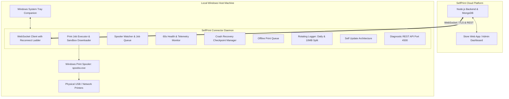

# SelfPrint Connector - System Architecture (Phase 5 Production Edition)

> **The connector is only the hardware bridge. The website is the brain.**

---

## 🎯 Architecture Summary

The **SelfPrint Connector** is a production-grade Windows background service. It has exactly **ONE** responsibility:

> **Bridge physical printers connected to THIS Windows machine with the SelfPrint Cloud Platform, execute print jobs reliably, stream live progress telemetry back to the cloud, and maintain uninterrupted operation through auto-reconnect, crash recovery, and health monitoring.**

---

## 🏛️ End-to-End System Topology



---

## 📂 Production Code Structure

```text
selfprint-connector/
├── installer/                         # Windows Deployment Scripts
│   ├── install-service.ps1            # Windows Background Service / Task installer
│   ├── uninstall-service.ps1          # Service uninstaller
│   ├── install-startup.ps1            # User Startup folder installer
│   ├── uninstall-startup.ps1          # User Startup uninstaller
│   └── run-silent.vbs                 # Zero-window background launcher
├── src/                               # Connector Windows Daemon
│   ├── app.ts                         # Process lifecycle & bootstrapper
│   ├── api/
│   │   └── routes.ts                  # Local REST API (/health, /printers, /jobs/history, /rescan)
│   ├── device/
│   │   └── identity.ts                # Stable hardware UUID generator
│   ├── printer/
│   │   ├── detectPrinters.ts          # WMI printer discovery (< 300ms)
│   │   ├── jobDownloader.ts           # Secure PDF downloader with retry & checksum
│   │   ├── jobExecutor.ts             # Complete PrintJobExecutor pipeline
│   │   ├── printerCache.ts            # Memory cache & diff engine
│   │   ├── printerMapper.ts           # Normalization & virtual printer filter
│   │   ├── printerStatus.ts           # Status & error mapping
│   │   ├── printHistory.ts            # Circular buffer for last 100 jobs
│   │   ├── spoolerControl.ts          # Pause, resume, cancel & restart commands
│   │   ├── spoolerWatcher.ts          # Active Windows Spooler queue watcher
│   │   └── watchPrinters.ts           # 30s background scan loop
│   ├── queue/
│   │   └── offlineQueue.ts            # Offline print persistence & auto-drain
│   ├── recovery/
│   │   └── crashRecovery.ts           # State checkpointing & recovery engine
│   ├── services/
│   │   ├── healthMonitor.ts           # 60s CPU, RAM, Disk, Latency & Spooler monitor
│   │   ├── heartbeat.ts               # 15s Heartbeat beacon with full health telemetry
│   │   ├── registration.service.ts    # POST /api/v1/connectors/register
│   │   └── sync.service.ts            # Watcher coordinator
│   ├── storage/
│   │   └── connectorStore.ts          # Persistent settings & identity storage
│   ├── tray/
│   │   └── trayManager.ts             # Windows System Tray companion process
│   ├── update/
│   │   └── updateChecker.ts           # Version comparison & update emitter
│   ├── utils/
│   │   ├── logger.ts                  # Multi-level logger facade
│   │   ├── printLogger.ts             # Dedicated print execution logger
│   │   ├── printerLogger.ts           # Dedicated printer audit logger
│   │   └── rotatingLogger.ts          # Daily rotation, 10MB split, 30-day purge
│   └── websocket/
│       └── socket.ts                  # WebSocket bridge with exponential ladder & hot reload
└── docs/                              # System Documentation
    ├── README.md
    ├── ARCHITECTURE.md
    ├── PROJECT_STATUS.md
    ├── CHANGELOG.md
    ├── RECOVERY.md
    ├── WINDOWS_SERVICE.md
    ├── PRINT_PIPELINE.md
    ├── FLOW.md
    ├── API_REFERENCE.md
    └── CONNECTOR_PROTOCOL.md
```

---

## 🛡️ Production Reliability Subsystems

### 1. Reconnect Ladder
- If the backend is unreachable, the WebSocket reconnects automatically following intervals: `[2s, 5s, 10s, 20s, 30s]` repeating indefinitely.
- No user interaction is ever required.

### 2. Config Hot Reload
- Backend configuration updates (heartbeat interval, scan interval, log level, backend URL) apply immediately **without restarting the connector daemon**.

### 3. Log Rotation & Storage Management
- Log files rotate daily (`connector-YYYY-MM-DD.log`, `print-YYYY-MM-DD.log`, `printer-YYYY-MM-DD.log`).
- Individual log files exceeding 10MB automatically split with timestamped archives.
- Automated 24-hour cleanup purges archives older than 30 days.

### 4. Health Telemetry Monitor
- Every 60 seconds, the connector measures:
  - CPU usage %
  - Memory (Total, Free, Process RSS)
  - Disk Space (Free GB, Total GB on C:)
  - Windows Uptime & Connector Uptime
  - Windows Print Spooler Service State (`Running` / `Stopped`)
  - Internet & Backend Roundtrip Latency (ms)
  - Installed Printer Count & Active Spooler Queue Size
- Telemetry is transmitted automatically in the 15-second heartbeat beacon.
