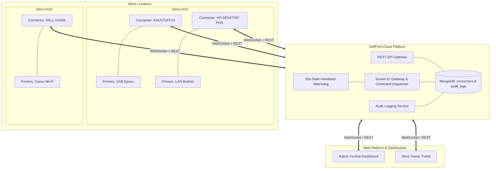

# SelfPrint Connector — Backend Architecture & Management System

> **The Connector is the Bridge. The SelfPrint Backend is the Brain.**

---

## 🏛️ System Architecture

The **SelfPrint Backend** acts as the central control plane managing all distributed connector instances across physical store locations.



---

## 🧩 Core Responsibilities of the Backend

1. **Connector Registry & Identity**:
   - Stores hardware fingerprints (`machineId`, `hostname`, `windowsUser`, `osVersion`, `connectorVersion`).
   - Issues and verifies secure HMAC-SHA256 JWT `deviceToken` credentials.
2. **Store Tenancy & Multi-Connector Mapping**:
   - Every connector belongs to **at most ONE** store.
   - A single store can have **multiple** active connectors (e.g. Front Desk POS + Back Office Production).
   - Only physical printers connected to a specific computer are reported by that connector.
3. **Hardware State & Inventory Synchronization**:
   - Stores real-time snapshots of all local, USB, and network printers per machine.
   - Prevents duplicate printer entries and tracks online/offline/error states.
4. **Health Telemetry & Stale Watchdog**:
   - Tracks CPU %, RAM, Disk, Uptime, Latency, and Windows Print Spooler health.
   - Background watchdog runs every 60s; if `lastHeartbeat > 60s`, flags connector as `OFFLINE` and notifies connected dashboards.
5. **Command Dispatching Engine**:
   - Broadcasts real-time hardware commands (`refresh_printers`, `print_pdf`, `pause_printer`, `resume_printer`, `restart_printer`, `cancel_job`, `request_status`, `update_config`) over dedicated Socket.IO rooms.
6. **Immutable Audit Trail**:
   - Records every registration, heartbeat, offline timeout, status change, command dispatch, store assignment, and deletion.

---

## 🗄️ Database Schemas (MongoDB)

### 1. `connectors` Collection
```typescript
{
  _id: ObjectId,
  connectorId: String,          // Unique ID: "cntr_d44f4051-..."
  machineId: String,            // Unique Machine Hash: "mach_8189c520..."
  deviceTokenHash: String,      // SHA-256 hash of device token
  hostname: String,             // e.g. "ASUSTUFF15"
  windowsUser: String,          // e.g. "ASUS"
  osVersion: String,            // e.g. "Windows 11 Home 23H2"
  connectorVersion: String,     // e.g. "0.2.0"
  status: 'ONLINE' | 'OFFLINE' | 'ERROR',
  lastHeartbeat: Date,
  lastSeen: Date,
  currentIp: String,
  storeId: String | null,       // Reference to Store
  connectedPrinters: [
    {
      id: String,
      name: String,
      driverName: String,
      portName: String,
      location: String,
      manufacturer: String,
      model: String,
      isDefault: Boolean,
      isNetwork: Boolean,
      isShared: Boolean,
      status: 'ONLINE' | 'OFFLINE' | 'PAPER_JAM' | 'OUT_OF_PAPER' | 'LOW_TONER' | 'PRINTING' | 'PAUSED' | 'ERROR',
      isOnline: Boolean,
      jobsWaiting: Number,
      colorSupport: Boolean,
      duplexSupport: Boolean,
      paperSizes: [String],
      connectionType: 'USB' | 'NETWORK' | 'SHARED' | 'LOCAL' | 'WIRELESS' | 'BLUETOOTH'
    }
  ],
  cpu: Number,                  // CPU usage %
  ram: {
    totalMB: Number,
    freeMB: Number,
    processMB: Number
  },
  disk: {
    freeGB: Number,
    totalGB: Number
  },
  internet: Boolean,
  uptime: Number,
  latency: Number,
  printerCount: Number,
  activeQueueSize: Number,
  spoolerStatus: String,
  isActive: Boolean,
  createdAt: Date,
  updatedAt: Date
}
```

### 2. `connector_audit_logs` Collection
```typescript
{
  _id: ObjectId,
  connectorId: String,
  action: 'REGISTRATION' | 'HEARTBEAT' | 'ONLINE' | 'OFFLINE' | 'PRINT_COMMAND' | 'RESTART' | 'PAUSE' | 'RESUME' | 'ASSIGNMENT' | 'UNASSIGNMENT' | 'DELETION' | 'CONFIG_UPDATE' | 'STATUS_CHANGE',
  details: Object,
  performedBy: String,          // 'SYSTEM', 'WATCHDOG', 'ADMIN', or userId
  ipAddress: String,
  timestamp: Date
}
```
