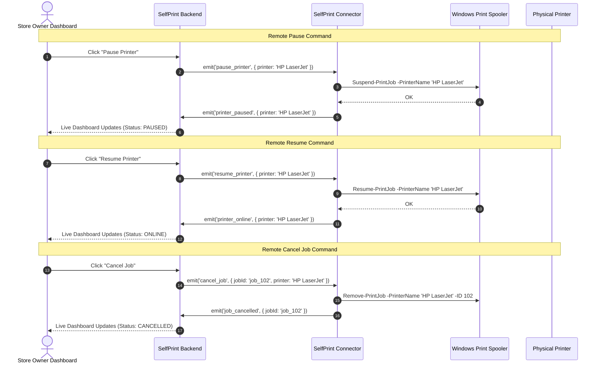
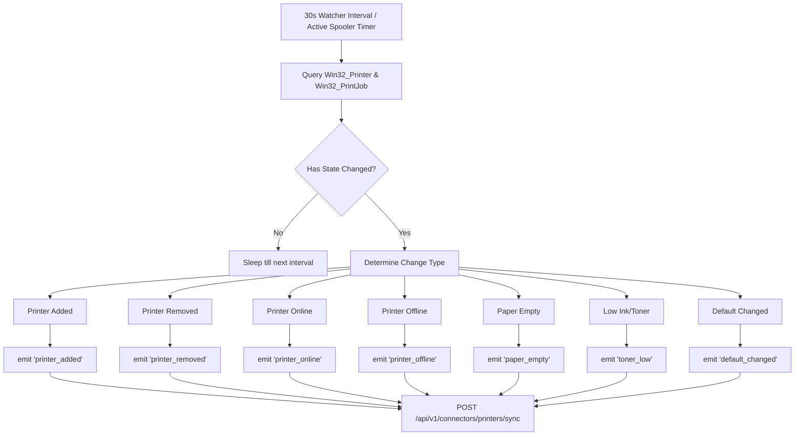

# SelfPrint Connector — Architectural & Runtime Flows

> **Sequence diagrams and flowcharts for Remote Commands, Spooler Watching, and Watcher Polling.**

---

## ⚡ 1. Remote Hardware Commands Flow

---

## 🔄 2. Spooler Watcher & Status Polling Flow

