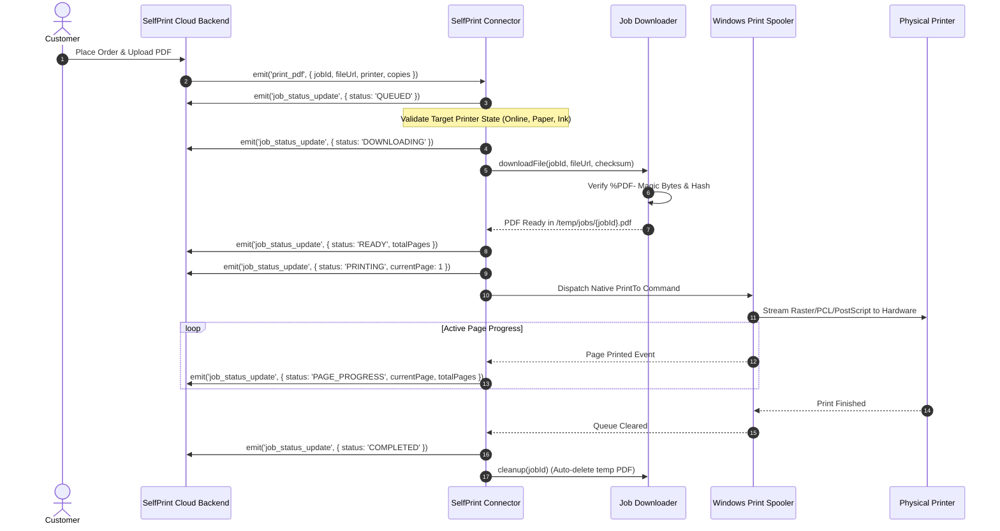

# SelfPrint Connector — End-to-End Print Pipeline

> **Technical specification for secure PDF downloading, capability validation, Windows Spooler execution, live progress streaming, and lifecycle history.**

---

## 🎯 High-Level Overview

```
Customer Uploads PDF
         │
         ▼
SelfPrint Cloud Backend
         │
         ▼ (WebSocket `print_pdf` / `new_print_job`)
SelfPrint Connector
         │
         ├── 1. Validation (Target printer online, paper size, capabilities)
         ├── 2. Secure Download (`/temp/jobs/{jobId}.pdf` + magic-byte & checksum check)
         ├── 3. Spooling (PowerShell `Start-Process -Verb PrintTo`)
         ├── 4. Spooler Watcher (Tracks pages printed & queue state)
         ├── 5. Live Progress Telemetry (Emits status transitions via Socket.IO)
         └── 6. Automatic Sandbox Cleanup (Shreds downloaded PDF)
         │
         ▼
Windows Print Spooler (spoolsv.exe)
         │
         ▼
Physical Printer (USB / LAN / Wi-Fi / Bluetooth)
```

---

## 🔁 Complete Print Execution Sequence Diagram



---

## 📊 Live Status State Machine

```text
[QUEUED] ──► [DOWNLOADING] ──► [READY] ──► [PRINTING] ──► [PAGE_PROGRESS] ──► [COMPLETED]
    │              │             │             │
    └──────────────┴─────────────┴─────────────┴────────► [FAILED] / [CANCELLED]
```

| Status | Trigger Condition |
|---|---|
| `QUEUED` | Job received from backend over WebSocket. Target printer lookup initiated. |
| `DOWNLOADING` | Secure download from HTTPS CDN started with exponential backoff retries. |
| `READY` | PDF validated (`%PDF-` magic bytes, checksum match, page count parsed). |
| `PRINTING` | Job dispatched to Windows Print Spooler (`spoolsv.exe`). |
| `PAGE_PROGRESS` | Live page milestone reached (e.g. Page 2 of 5 printed). |
| `COMPLETED` | Spooler finished rasterization and hardware marking without error. |
| `FAILED` | Printer offline, out of paper, paper jam, corrupted PDF, or execution timeout. |
| `CANCELLED` | Remote operator or backend cancelled job via `cancel_job`. |

---

## 🛡️ Error Handling & Fault Isolation

| Error Condition | Connector Behavior | Telemetry Dispatched |
|---|---|---|
| **Printer Offline / Disconnected** | Rejects job before download. Does not waste bandwidth. | `FAILED` with `PRINTER_OFFLINE` |
| **Out of Paper / Paper Jam** | Detects hardware fault via WMI error bits prior to spooling. | `FAILED` + `paper_empty` / `paper_changed` |
| **Corrupted Download** | Verifies `%PDF-` header and SHA-256 hash. Re-attempts download up to 3 times before aborting. | `FAILED` (Checksum / Magic Byte Mismatch) |
| **Spooler Timeout** | 90-second timeout guard prevents background process hanging. | `FAILED` + `JOB_TIMEOUT` |
| **Operator Cancellation** | `cancel_job` immediately issues `Remove-PrintJob` and aborts active process. | `CANCELLED` + `job_cancelled` |

---

## 📜 In-Memory Print History (Circular Buffer)

The connector maintains an in-memory buffer of the last **100 jobs** for local diagnostics via `GET /jobs/history`:

```json
[
  {
    "jobId": "job_102938",
    "printer": "HP LaserJet Pro MFP M428fdw",
    "startedAt": "2026-09-08T23:30:00.000Z",
    "completedAt": "2026-09-08T23:30:12.500Z",
    "durationMs": 12500,
    "pages": 4,
    "copies": 1,
    "status": "COMPLETED",
    "error": null
  }
]
```
