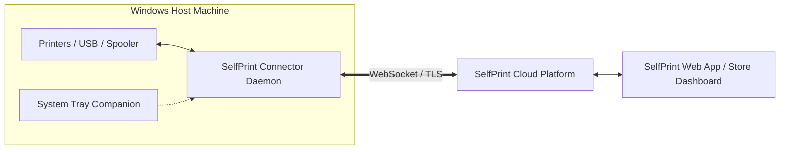

# SelfPrint Connector

> **Production-Grade Windows Background Service bridging local physical printers with the SelfPrint Cloud Platform.**

---

## 📖 Overview

The **SelfPrint Connector** is a lightweight, headless Windows service. Its sole responsibility is to **detect and control physical/local printers connected to the host machine and expose them securely to the SelfPrint web platform.**



### Key Highlights
- **Pure Hardware Bridge**: Zero business logic, no customer accounts, no store management, no payments.
- **Silent Operation**: Runs in the background as a Windows Service or Startup daemon without terminal or browser windows.
- **Auto Reconnection**: Exponential reconnect ladder (2s -> 5s -> 10s -> 20s -> 30s) ensures self-healing connectivity.
- **Offline Resilience**: Automatically caches pre-downloaded jobs and never aborts in-flight prints during network drops.
- **Health Telemetry**: Live CPU, RAM, Disk, Uptime, Spooler status, and Latency transmitted via 15s heartbeats.
- **Daily Rotating Logs**: 10MB size limit, daily files (`connector-YYYY-MM-DD.log`), automatic 30-day purge.
- **Crash Recovery**: Checkpointed state (`config/recovery.json`) guarantees zero printer data loss across restarts.
- **System Tray Companion**: Minimal status indicator, Reconnect, Logs viewer, Restart, and Exit controls.

---

## 🛠️ Technology Stack

- **Runtime**: Node.js LTS (v18+)
- **Language**: TypeScript 5.x (Strict Mode)
- **Networking**: Socket.IO Client 4.x, native fetch
- **Windows Integration**: PowerShell CIM/WMI (`Win32_Printer`, `Win32_PrintJob`), Windows Print Spooler service
- **Storage**: Lightweight JSON storage (`config/connector.json`, `config/recovery.json`, `config/offlineQueue.json`)

---

## 🚀 Getting Started

### 1. Installation
```bash
npm install
```

### 2. Configuration
Copy `.env.example` to `.env`:
```env
PORT=4500
BACKEND_URL=http://localhost:3000
LOG_LEVEL=info
HEARTBEAT_INTERVAL_MS=15000
PRINTER_SCAN_INTERVAL_MS=30000
INCLUDE_VIRTUAL_PRINTERS=false
```

### 3. Build & Run
```bash
npm run build
npm start
```

---

## 🔧 Windows Service & Startup Deployment

See detailed instructions in [docs/WINDOWS_SERVICE.md](file:///d:/project/SELFPRINT%20SYSTEM/selfprint-connector/docs/WINDOWS_SERVICE.md):

* **Install Windows Service**: Run `installer/install-service.ps1` (Admin)
* **Install User Startup Shortcut**: Run `installer/install-startup.ps1`
* **Uninstall**: Run `installer/uninstall-service.ps1` or `installer/uninstall-startup.ps1`

---

## 💻 Local Diagnostic API (Port 4500)

- `GET /health` — Service status, uptime, and machine identification
- `GET /printers` — Local printers list with online status and capabilities
- `GET /printers/:id` — Printer details by ID or Name
- `POST /rescan` — Trigger immediate local hardware scan
