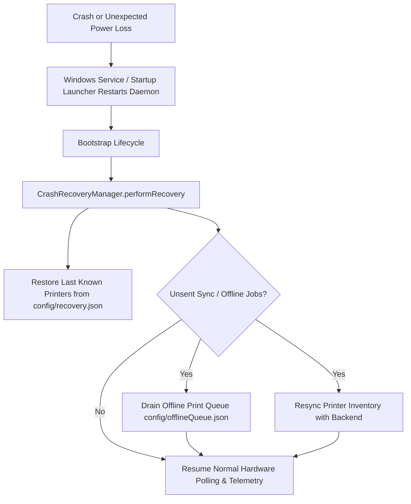

# SelfPrint Connector — Crash Recovery & Fault Tolerance Guide

The SelfPrint Connector is engineered with defense-in-depth reliability mechanisms to ensure uninterrupted operation as an unattended Windows background bridge.

---

## 1. Crash Recovery Architecture



---

## 2. Checkpoint Persistence (`config/recovery.json`)

The connector maintains a real-time disk checkpoint containing:
* **`lastPrinters`**: Full cached hardware snapshot of all local, USB, and network printers.
* **`lastHeartbeat`**: Timestamp of the latest successful cloud beacon.
* **`unsentPrinterSync`**: Boolean flag indicating whether a printer status diff or state transition was waiting for backend transmission when an interruption occurred.
* **`unfinishedJobs`**: Array of in-flight print job IDs.

### Recovery Workflow on Boot
1. **Printer Cache Priming**: Before the first live Windows spooler scan completes, the connector restores the cached printer inventory to prevent temporary empty state broadcasts.
2. **Replay Pending Hardware Sync**: If `unsentPrinterSync` is true, the connector immediately dispatches the latest hardware state upon restoring cloud WebSocket connectivity.

---

## 3. Offline Print Queue (`config/offlineQueue.json`)

If the backend loses network connectivity or the cloud server restarts while a print job command is issued:
* **Pre-Download Disconnect**: If the backend disconnects before the PDF download begins, the job payload is safely written to `config/offlineQueue.json`.
* **Post-Download Disconnect**: If the PDF is already downloaded and spooled locally, **the print job is never cancelled**. Windows Spooler executes the physical print to completion regardless of cloud connectivity.
* **Automatic Queue Draining**: When the WebSocket reconnects, `offlineQueue.drainQueue()` runs automatically, sequentially printing pending offline jobs.

---

## 4. Uncaught Exceptions & Process Armor

The connector wraps the Node.js runtime with global error traps:
```typescript
process.on('uncaughtException', (err: Error) => {
  logger.error('Unhandled Exception caught:', err);
});

process.on('unhandledRejection', (reason: unknown) => {
  logger.error('Unhandled Promise Rejection caught:', reason);
});
```

Common hardware edge cases that are caught and safely handled without crashing:
* Printer USB physically unplugged during operation
* Network printer offline or IP address reallocated
* Windows Print Spooler (`spooler`) service stopped or restarted
* Temporary backend network timeouts or unreachable DNS
* Malformed WebSocket packets or unexpected payloads
* Corrupted PDF binaries or 0-byte downloads
* Windows permission or file lock exceptions
