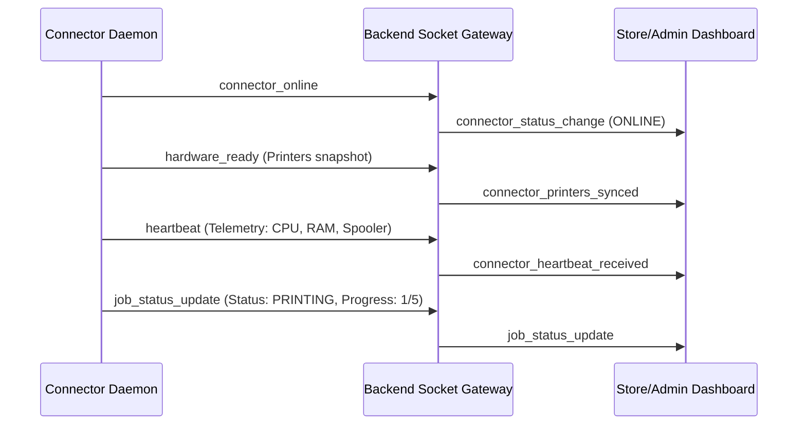
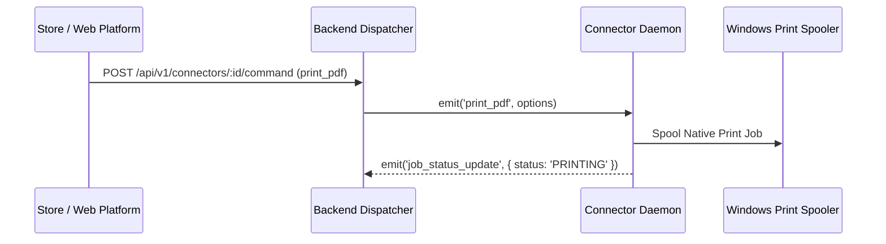

# SelfPrint Connector — Socket.IO Realtime Protocol & Events

This document details every realtime event exchanged between the **SelfPrint Connector** (Windows Bridge) and the **SelfPrint Backend** (Cloud Platform).

---

## 🔌 Connection & Handshake

When connecting, the connector passes authentication in `socket.handshake.auth`:
```javascript
{
  connectorId: "cntr_d44f4051-a32a-401d-af78-6bfa6b3bf242",
  machineId: "mach_8189c52071137cb4",
  deviceToken: "eyJhbGciOiJIUzI1NiIsInR5cCI6IkpXVCJ9...",
  hostname: "ASUSTUFF15",
  windowsUser: "ASUS",
  version: "0.2.0"
}
```

Upon verification, the backend automatically joins the socket to a private room: `connector:${connectorId}`.

---

## 📡 Upstream Events (Connector ➔ Backend)



### Event Specifications
1. **`connector_online`**: Emitted immediately upon connection.
2. **`hardware_ready`**: Full printer inventory snapshot on boot.
3. **`heartbeat`**: 15-second health telemetry packet.
4. **`printer_added`** / **`printer_removed`** / **`printer_online`** / **`printer_offline`** / **`printer_error`**: Real-time hardware status changes.
5. **`job_status_update`**: Realtime print progress streaming (`QUEUED` ➔ `DOWNLOADING` ➔ `READY` ➔ `PRINTING` ➔ `PAGE_PROGRESS` ➔ `COMPLETED` / `FAILED` / `CANCELLED`).

---

## 🕹️ Downstream Commands (Backend ➔ Connector)

Commands are emitted into the private room `connector:${connectorId}`:



### Supported Commands
| Command | Payload | Description |
|---|---|---|
| `print_pdf` / `new_print_job` | `{ jobId, fileUrl, printerName, copies, paperSize }` | Downloads PDF securely and sends to physical printer |
| `cancel_job` | `{ jobId, printer }` | Aborts active in-flight or spooled job |
| `pause_printer` | `{ printer }` | Pauses the Windows print queue for that printer |
| `resume_printer` | `{ printer }` | Resumes paused Windows print queue |
| `restart_printer` | `{ printer }` | Restarts print spooler queue for that printer |
| `refresh_printers` / `rescan` | `{}` | Forces immediate WMI hardware scan |
| `request_status` | `{ printerName, requestId }` | Requests live status check of target printer |
| `update_config` | `{ settings: { heartbeatIntervalMs, scanIntervalMs, logLevel, backendUrl } }` | Hot reloads connector configuration without restarting daemon |
| `ping` | `{}` | Keepalive ping (replies with `pong`) |

---

## ⏱️ Watchdog Event (Backend ➔ Dashboards)

If a connector stops sending heartbeats for **> 60 seconds**, the backend watchdog emits:
* **Event**: `connector_offline`
* **Payload**:
```json
{
  "connectorId": "cntr_d44f4051-a32a-401d-af78-6bfa6b3bf242",
  "machineId": "mach_8189c52071137cb4",
  "hostname": "ASUSTUFF15",
  "storeId": "store_101",
  "lastHeartbeat": "2026-09-08T23:40:00.000Z",
  "timestamp": "2026-09-08T23:41:00.000Z"
}
```
