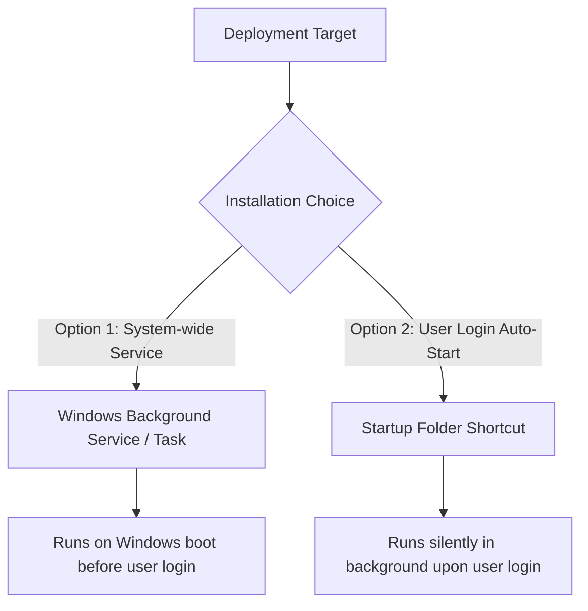

# SelfPrint Connector — Windows Service & Auto-Start Guide

The SelfPrint Connector is designed to run silently as a 24/7 background Windows daemon with zero console windows, no browser popups, and minimal resource footprint.

---

## 1. Installation Modes



---

## 2. Option 1: Install as Windows Service / Background Task

To install the connector as a permanent background service running under `SYSTEM` authority:

### Step 1: Open PowerShell as Administrator
Right-click PowerShell and select **Run as Administrator**.

### Step 2: Run Service Installer
```powershell
cd "d:\project\SELFPRINT SYSTEM\selfprint-connector\installer"
.\install-service.ps1
```

### Features:
* Starts automatically on Windows boot.
* Runs silently in Session 0 / Background with no terminal window.
* Automatically restarts after 5 seconds if terminated.
* Uses NSSM (if present in `installer/nssm.exe`) or Windows High-Availability Scheduled Task.

### To Uninstall:
```powershell
cd "d:\project\SELFPRINT SYSTEM\selfprint-connector\installer"
.\uninstall-service.ps1
```

---

## 3. Option 2: Install into Windows Startup Folder (Per-User)

To start the connector automatically whenever the Windows desktop user logs in:

### Step 1: Run Startup Installer
```powershell
cd "d:\project\SELFPRINT SYSTEM\selfprint-connector\installer"
.\install-startup.ps1
```

### Features:
* Adds a shortcut in `%APPDATA%\Microsoft\Windows\Start Menu\Programs\Startup\SelfPrintConnector.lnk`.
* Executes via `installer/run-silent.vbs` using `wscript.exe` with `WindowStyle=0` (completely invisible background process).
* Automatically launches the **System Tray Companion** (`SelfPrint Connector` icon in Windows system tray).

### To Uninstall:
```powershell
cd "d:\project\SELFPRINT SYSTEM\selfprint-connector\installer"
.\uninstall-startup.ps1
```

---

## 4. System Tray Companion

When running in an interactive Windows desktop session, a minimal icon appears in the system tray.

### Context Menu Layout:
```
SelfPrint Connector (v0.2.0)
----------------------------
Status: Connected
Reconnect
Open Logs
Restart
Exit
```

* **Status**: Live indicator of WebSocket link to SelfPrint Cloud.
* **Reconnect**: Manually forces immediate WebSocket and heartbeat reconnect.
* **Open Logs**: Opens `logs/` directory in Windows Explorer.
* **Restart**: Gracefully restarts the connector daemon.
* **Exit**: Gracefully terminates the connector daemon.

---

## 5. Headless Mode Configuration

To suppress the system tray icon (e.g. on Windows Server or unattended kiosk machines), set:
```env
HEADLESS=true
# or
NO_TRAY=true
```
in `.env` or system environment variables.
